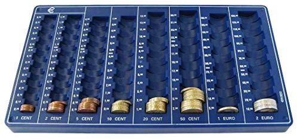

Today I was transferring some coins from the donation jar at [Kanthaus](https://kanthaus.online) to the cash box. Although this was my first time, I guessed the relatively trivial task would be easy—yet it turned out to be surprisingly difficult. I blame the design. The box looked like this:

The coins are separated into three horizontal trays and two containers. Each tray contains a mixture of coins as indicated by labels written on their bases, from top to bottom: 20c & 1c, 50c & 2c and €1 & 10c. The tube container is marked for €2 and the egg-shaped one for 5c. This isn't technically very challenging: much simpler than a jigsaw puzzle for example. However it is more complicated than necessary. Consider:

- the tray labels are covered by the coins, making the mixtures look random,
- there is no obvious order of coins, meaning the place for each coin has to be learned independently,
- the open trays and closed containers require different types of visual identification (i.e. image of coin vs. label,)
- the open trays and closed containers require different physical actions (i.e. dropping into place vs. opening and adding,)

These points may seem trivial; none by themself is particularly taxing. However they add up, presenting a new user with the task of learning before they can carry out their task at hand. Aside from redesigning it better, my options were to:

1. **learn the design** with its unnecessary complexity, wasting my time and that of future users,
2. **break the design** by throwing the coins in randomly, wasting the time of users now familiar with the current design,
3. **avoid the design** by giving up on the task, leading to a centralization of work on fewer users,

I added cardboard spacers to the trays to make one section for each coin and ordered the sections from most valuable to least:

These small changes greatly simplify the process of sorting coins: a user now simply needs to visually match the coin (one identification) and drop them into place (one action). The observant reader will realise this 'new' design isn't really—it resembles a standard money tray. Copying or mimicking popular designs is not particularly exciting, but it can dramatically reduces the amount of learning a user needs to do. For example, if you were designing a set of taps, you'd probably want to colour the cold one blue and the hot one red.

The responsibility for designers to understand user needs was impressed upon me from reading Don Norman's book, ['The Design of Everyday Things.'](http://www.nixdell.com/classes/HCI-and-Design-Spring-2017/The-Design-of-Everyday-Things-Revised-and-Expanded-Edition.pdf) Don explains how fantastically error-prone and cognitively-limited humans are, and that the effort of learning is increased with every new procedure a person has to learn. Designers, being completely familiar with their own designs, can be blinded to the difficulties users will face unless they're careful.

This is about more than a cash box! The ease with which people can confidently take on tasks is directly related to personal autonomy. If things are unnecessarily complicated (or necessarily complex without documentation) it's often easier for the person who already knows how to do it to just do it themselves. Specialization to the point of centralization introduces points of failure from burn-out, absence and even manipulation. Social interventions such as job rotation can counteract centralization, but if the same effect can be reached with passive design, it is perhaps even more resilient.

At Kanthaus we have the principles of _self-determination, equivalence and mutual-interest_. Designing well is perhaps the most crucial method for systematically upholding our principles. This is especially important for us at Kanthaus to remember with our strong anti-waste convictions: a thing is not designed well simply because it's made with upcycled material!

Having empathy for users seems to be critical to good design. Indeed the 'goodness' of a design appears to be dependent on users experience, not the designer's opinion. Through good design we help people use their time and effort more effectively with fewer mistakes; designers should share their users frustrations and joy. Happy designing and user-testing!

---

_Syndicated to the [Kanthaus blog](https://kanthaus.online/en/blog/2018-07-17_cash-box-design)_

