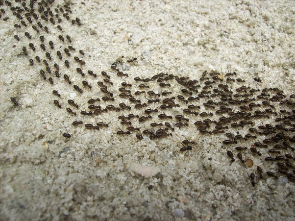
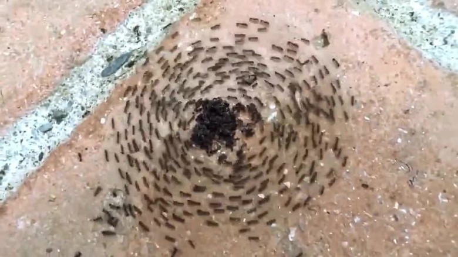

I used to think that customs were bad. Unwritten, unspoken rules, only there to separate the uninitiated from the elders.

I've made a U-turn—with caveats.

Customs are perhaps the freest expression of self-organization. Like the stigmergy of ants, who in following the pheremone trail laid by previous ants, form orderly lines towards desirable destinations. Or like those well-used yet unpaved paths through parks: we don't know who starts them, but in following we contribute. 

<figure>
	
	<figcaption><i>It's unclear who started it, but it's apparently worth following...</i></figcaption>
</figure>

Not all action can be coordinated beforehand: we don't (yet!) have a hive-mind. Even in the most communicative groups, individuals will sometimes need to make decisions without consulting the others. A fraction of these autonomous actions will 'stick' — customs are inevitable.

Customs provide a space to iteratively experiment. One might slightly rearrange a living room, and the next a little more, until a steady-state is achieved without discourse or explicit agreement. It is in the space and freedom given by minimal coordination we reach maximal agency.

The custom can therefore be seen as a chain of consent, to be changed or ended also by consent. It is not a collective decision, even if all members of a collective follow it. From this perspective, in a non-hierarchical association, a person who doesn't consent to a custom may not be sanctioned.

A custom can become so well accepted by a group it assumes the status of a rule. That is, when someone (usually a new person) doesn't follow it, they can be sanctioned by anyone in the group with collective authority. This is tradition creep, and that's bad, because tradition is an archive, not an authority. If the traditionalist can say _"but we've always done it that way!"_, slowly the hierarchy of memory takes over. 

<figure>
	
	<figcaption><i>... blind/short-sighted following not so much.</i></figcaption>
</figure>

The consent argument against traditionalism rests on there never having been an explicit agreement. It seems obvious not to be held accountable for breaking an agreement you never made. However, if customs hold no power at all, all decisions must be made collectively. If the legalist can say _"but it's not written anywhere!"_, slowly the living group is replaced by a bureaucracy.

A respectful dialogue between the positions is possible, assuming the custom-holder accepts the custom-breaker never consented to follow, and the breaker acknowledges some wisdom may lie in the chain of consent. The holders may invite others to join the custom, _"We normally do X because Y, is that OK with you?"_, and if the answer is no... well, no means no. The holder can then consent to the non-compliance as an alteration of the custom, or initiate a collective process.

It should be telling if new people regularly deviate from a custom that it lacks sufficient intuitiveness and may the issue may be better addressed with a design intervention (e.g. affordance, restriction, signage) or governance intervention (e.g. rule)

Customs are living consent.
