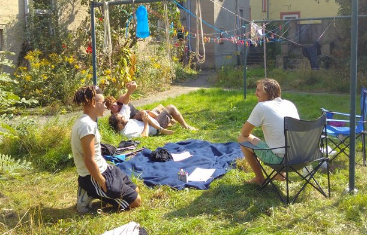

Two shabby buildings in a German town you've probably never heard of before have become home for a group of post-waste activists: we call it [Kanthaus](https://kanthaus.online). 

Located within the mesh of global challenges is the fact that 1/3 of edible food isn't eaten. The issue of waste is a focal point for our project, inherited from our involvement with [yunity.org](https://yunity.org/en) and [foodsharing.de](https://foodsharing.de/). We believe that waste can be avoided, and relationsips built, through sharing. Kanthaus is a platform for people to promote sharing and/or reduce waste.

I fell into this project early on and I'll present about the history, the first 6 months and future plans—

- on Friday 15th December, 17:30 as a standalone event at The Shrub, 13 Guthrie Street, Edinburgh EH1 1JG. This will be an interactive \~45 minute presentation with time for further discussion afterwards. Add it to your [Google calendar](http://www.google.com/calendar/event?action=TEMPLATE&dates=20171215T173000Z%2F20171215T193000Z&text=Introducing%20Kanthaus&location=The%20Shrub%2C%2013%20Guthrie%20Street%2C%20Edinburgh%20EH1%201JG.&details=Two%20shabby%20buildings%20in%20a%20German%20town%20you've%20probably%20never%20heard%20of%20before%20have%20become%20home%20for%20a%20group%20of%20post-waste%20activists%3A%20we%20call%20it%20Kanthaus.%0A%0ALocated%20within%20the%20mesh%20of%20global%20challenges%20is%20the%20fact%20that%201%2F3%20of%20edible%20food%20isn't%20eaten.%20The%20issue%20of%20waste%20is%20a%20focal%20point%20for%20our%20project%2C%20inherited%20from%20our%20involvement%20with%20yunity.org%20and%20foodsharing.de.%20We%20believe%20that%20most%20waste%20is%20due%20to%20outdated%20economics%20and%20that%20sharing%20provides%20solutions.%20Kanthaus%20is%20a%20platform%20for%20people%20promote%20sharing%20and%2For%20reduce%20waste.%0A%0AI%20fell%20into%20this%20project%20early%20on%20and%20I'll%20present%20about%20the%20history%2C%20first%206%20months%20and%20future%20plans%20in%20a%20~40%20minutes%2C%20interactive%20talk.%0A%0AOriginally%20posted%20here%3A%20https%3A%2F%2Fdouginamug.gitlab.io%2Fpost%2F2017-12-04_introducingkanthaus%2F), [any other calendar](data/15_Introducing_Kanthaus.ics) or via [Facebook](https://www.facebook.com/events/1245750915525444/).
- on Sunday 17th December as part of the Lightening Lectures event at Glasgow Autonomous Space, 53 Kilbirnie St, Glasgow, G5 8JD, UK. This will be a \~5 minute lecture will a \~5 minute discussion immediately afterwards. This event starts with food at 17:00 and with lectures starting at 19:00. Original event posted on [Facebook](https://www.facebook.com/events/1494599233959629/?active_tab=about), add it to your [Google calendar](http://www.google.com/calendar/event?action=TEMPLATE&dates=20171217T170000Z%2F20171217T220000Z&text=Introducing%20Kanthaus%20%40%20Lightening%20Lectures%3A%20LivingRoomLectures%20turns%202&location=Glasgow%20Autonomous%20Space%2C%2053%20Kilbirnie%20St%2C%20Glasgow%2C%20G5%208JD%2C%20UK&details=%23%20Introducing%20Kanthaus%0A%0ATwo%20shabby%20buildings%20in%20a%20German%20town%20you've%20probably%20never%20heard%20of%20before%20have%20become%20home%20for%20a%20group%20of%20post-waste%20activists%3A%20we%20call%20it%20Kanthaus.%0A%0ALocated%20within%20the%20mesh%20of%20global%20challenges%20is%20the%20fact%20that%201%2F3%20of%20edible%20food%20isn't%20eaten.%20The%20issue%20of%20waste%20is%20a%20focal%20point%20for%20our%20project%2C%20inherited%20from%20our%20involvement%20with%20yunity.org%20and%20foodsharing.de.%20We%20believe%20that%20most%20waste%20is%20due%20to%20outdated%20economics%20and%20that%20sharing%20provides%20solutions.%20Kanthaus%20is%20a%20platform%20for%20people%20promote%20sharing%20and%2For%20reduce%20waste.%0A%0AI%20fell%20into%20this%20project%20early%20on%20and%20I'll%20present%20about%20the%20history%2C%20first%206%20months%20and%20future%20plans%20in%20a%20~5%20minute%20flash-talk.%0A%0AOriginally%20posted%20here%3A%20https%3A%2F%2Fdouginamug.gitlab.io%2Fpost%2F2017-12-04_introducingkanthaus%2F%0A%0A------%0A%0A%23%20Lightening%20Lectures%0A%0AWE'VE%20MADE%20IT%20TO%20LIVING%20ROOM%20LECTURES'%202ND%20BIRTHDAY%20!!%20%26%20we're%20going%20to%20throw%20a%20shindig%20to%20celebrate!%0A%0ASunday%2017th%20December%0AG.A.S%2F%2F53%20Kilbirnie%20St%2C%20Glasgow%20G5%208JD5%0AThere%20will%20be%20food%20from%205%20and%20a%20cheap%20bar%20running%20from%208PM%0AFree%20in%20but%20donations%20welcome%0A%0A5-6PM%0AThere%20will%20be%20FOOD%20%5B!%5D%20and%20an%20exhibition%20of%20our%20anniversary%20pamphlet%2Fzine%20with%20contributions%20from%20past%20lecturers%2C%20artwork%2C%20stories%20and%20anecdotes%20on%20learning%2C%20living%20rooms%20and%20more%20besides.%0A%0A7-8.30PM%0Awe'll%20get%20on%20with%20the%20LIGHTENING%20LECTURES%20!!%20a%20series%20of%203-5%20minute%20talks%20followed%20by%20a%205-7%20minute%20discussion.%2010%20MINUTES%20MAX%20to%20test%20any%20ideas%2Fprojects%2Fthoughts%20you've%20had%20going%20on.%0Aso%20far%20we've%20got%20..%0ACee%20Smith%20with%20some%20period%20chat%20%2F%20Victoria%20McNulty%20with%20a%20lightening%20lecture%20about%20Capitalism%20and%20Travel%20%2F%20James%20McAveety%20discussing%20the%20album%20'The%20La's'%2C%20by%20The%20La's%20%2F%20Adam%20Cheshire%20with%20some%20chat%20about%20mimetics%20%2F%20Gabe%20Featherstone%20with%20a%20song%20about%20moral%20hygiene%20and%20vegetables%0AMORE%20YET%20TO%20BE%20ANNOUNCED%20!%20%2F%20give%20us%20a%20message%20if%20u%20want%20a%20shot%0A%0A8.30-10PM%0ALive%20music.%20We've%20got%20some%20interested%20acts%20lined%20up%2C%20which%20we'll%20be%20revealing%20over%20the%20next%20few%20weeks%0A%0A10%20-%20till%20whenever%20we%20chuck%20you%20out%20PM%0AA%20DJ%20set%20from%20Natasha%20Lal%0A%0Agive%20us%20a%20message%20on%20here%20or%20an%20email%20over%20to%20livingroomlecturesglasgow%40gmail.com%20if%20you're%20up%20for%20doing%20a%20living%20room%20lecture%20or%20playing%20music%20on%20the%20night%20!%20there's%20still%20space%20going%20%0A%0AOriginally%20posted%20here%3A%20https%3A%2F%2Fwww.facebook.com%2Fevents%2F1494599233959629%2F) or [any other calendar](data/17_Introducing_Kanthaus.ics).

Hope to see you there!
