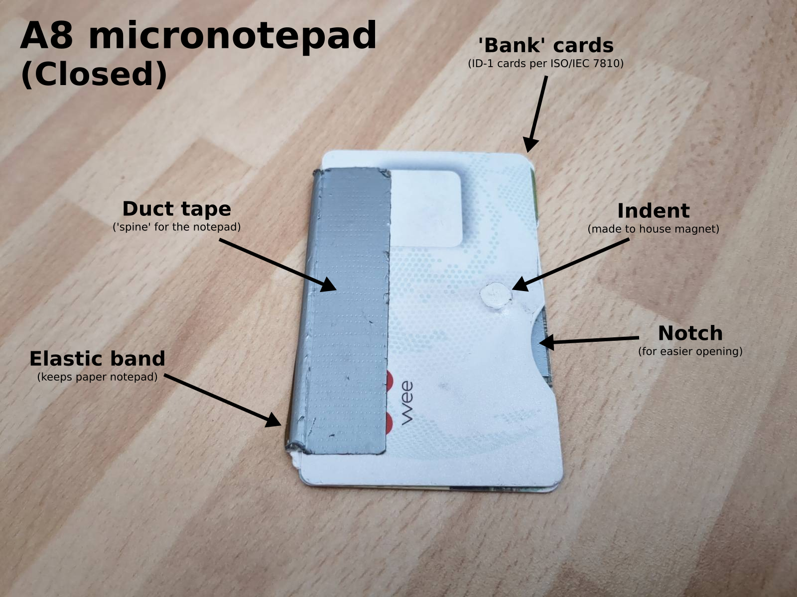
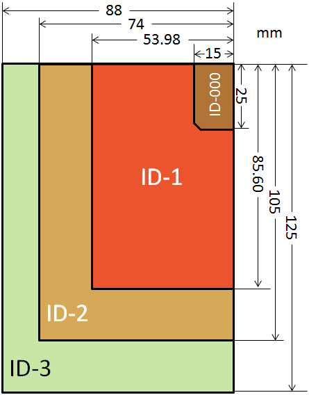
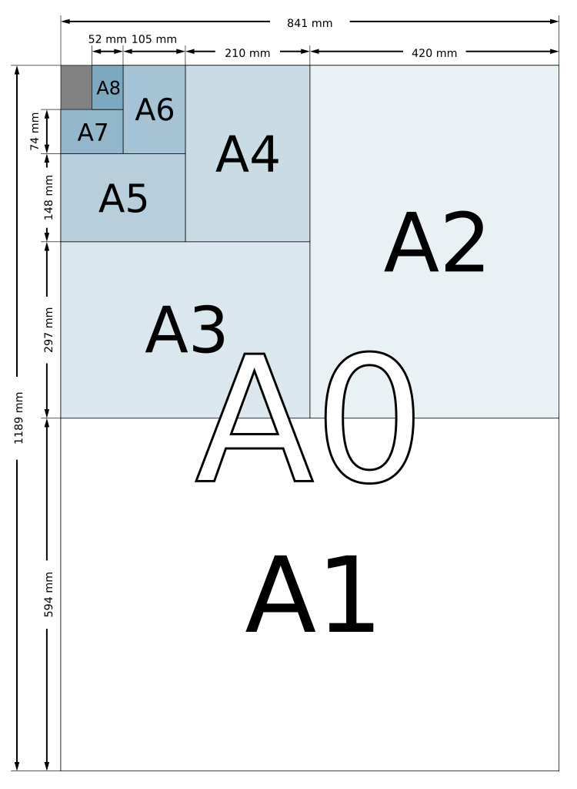

If you've met me in the last years, there's a good chance you've seen me whip out a tiny notepad at some point to write something down. This notepad is pretty much two bank cards, with a bit of duct tape as a 'spine' and an elastic band to keep the paper in. This design came out of a need to have a completely portable way to take notes. 

Yes, I do have my phone with me most of the time, but not all the time, and sometimes it's out of power, and I usually like to have it off—especially when I'm having interesting conversations. Even when it's on 'do not disturb' mode, I feel the temptation to break conversation to check a fact or find a link, which noticibly harms my attention span and imagination. (I also keep my devices out of the room I sleep in, try to turn them on as late into the day as possible and off as early into the evening as possible. Digital health, yeah!)

I added the notches to make it a bit easier to open. The indent for the magnet I think I just made with brute force and a round object... doing so allows the notepad to close more tightly, and less likely to open in error. In case you're interested, the 'standard' bank card size is 85.6 mm × 53.98 mm, as per the ID-1 format of [ISO / IEC 7810](https://en.wikipedia.org/wiki/ISO/IEC_7810).

<figure>
	
	<figcaption><i>By <a href="https://commons.wikimedia.org/w/index.php?curid=26228099">Someone&#039;s Moving Castle</a>, CC BY-SA 3.0</i></figcaption>
</figure>

A piece of A7 ([ISO 216!](https://en.wikipedia.org/wiki/Paper_size)) folded in half, fits nicely inside to give four sides of A8. A7 can be made by cutting a piece of A4 in half, lengthwise 3 times, or by cutting a piece of A5 in half, lengthwise twice.

<figure>
	
	<figcaption><i>By <a href="https://commons.wikimedia.org/w/index.php?curid=1369452">User:Bromskloss</a>, CC BY-SA 3.0</i></figcaption>
</figure>

I'd love to find other low-tech personal information management enthusiasts! Improvements to this design? Let me know! (I especially dislike using duct tape for the spine, which needs to be replaced every ~year)
