## Abstract
The power and responsibility one has in a situation is formalised by one's position within it; positions and the ways of entering/exiting them — _position systems_ — are thus a foundational governance concern. Constitutional ambiguities may remain hidden and newcomer empowerment may be obstructed if a position system is not clearly understood. This article aims to make such information more easily understandable through visualisation with appropriate diagrams. To establish a grounded understanding of position systems and their context within governance, the Institutional Analysis and Development framework is examined. The state machine model, which represents system behaviour as states and transitions, is then considered as a fit for position systems. The argument is made that position system can be modelled as state machines, with positions and their entry/exit events being mappable onto states and transitions respectively. The extension of state diagrams to statecharts are well-suited to visualize position systems. The planning and production of such a position statechart for a real-life case using pen & paper and free and open-source software is demonstrated.

<figure>
	
    <figcaption><strong>Figure 1. </strong>A position statechart of the Kanthaus position system. (Position changes which are voluntary or result from conflict resolution intervention not shown.) <a href="/excalidraw/3_KanthausPositionStatechart.excalidraw">Source 🗡️</a></figcaption>
</figure>

## Introduction 
In 2025 I initiated a change to the [Kanthaus constitution](https://git.kanthaus.online/kanthaus/kanthaus-governance/src/branch/master/documents/constitution/constitution.en.md). ([Kanthaus](https://kanthaus.online) is a "project house" I co-founded in 2017.) The system of positions had some [long-standing issues](https://wiki.kanthaus.online/User:Doug/(Archive)_2025_position_system_proposal) I wanted to fix. During the discussion to find a solution, David posted a "state/flow chart" he had sketched to clarify the _status quo_ (Figure 2.)

<figure>
	
    <figcaption><strong>Figure 2. </strong>David's state/flow chart of the Kanthaus position system.</figcaption>
</figure>

I had made vague sketches in that direction in the past, but nothing so comprehensive. Although graphically a bit confusing, the chart helped make the somewhat challenging text of the constitution easier to understand, and highlighted some ambiguities: could a person become a Visitor through an evaluation at a higher position without a host? Without conclusively resolving every issue, we came to a good-enough consensus and changed the constitution. David's diagram sank into memory.

Then in early summer 2026 I went to friend's doctoral defence. As the debate over the philosophy and history of ideas washed over me, I leafed through a hard-copy of the thesis. The utility of diagrams sprang back to my attention when I read, and re-read:

> It is important to note that all Young Hegelians were Left Hegelians, however, not all Left Hegelians were Young Hegelians.

While I understand such claims as text, it takes noticeable effort. In comparison, an equivalent diagram, in this case an Euler diagram, feels almost effortless (Figure 3.)

<figure>
	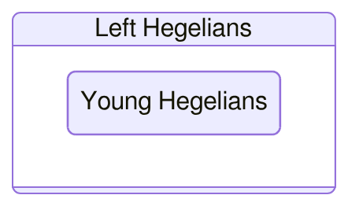
    <figcaption><strong>Figure 3. </strong>Set relation of Left and Young Hegelians. <a href="mermaid/1_Set-of-Hegelians.mermaid">Source 🧜</a></figcaption>
</figure>

And with that prompt, David's chart and the difficulty of comprehending the constitution came back to haunt me.[^inspirationOuborous]

An argument for clear and transparent governance is made on egalitarian grounds by Jo Freeman in _The Tyranny of Structurelessness_ (1972). In her reflection on the US feminist movement, Freeman describes their rejection of formal governance ("structure") in reaction to the over-structured society women found themselves dispossessed by. While this approach did have some liberatory effects, the outright refusal to make _de facto_ power structures transparent ultimately contributed to the formation of elites. The argument would be made on economic and ecological grounds with empirical justification some time later by Elinor Ostrom in _Governing the Commons_ (1990), which we'll come back to shortly.

History and theory aside, anyone who's done any amount of organising will simply know how critical it is that everyone knows the rules, structures, governance. While text will likely remain the primary medium, could accessibility and comprehension be improved through visualisations? I say _yes_.

## 1 Position systems 
I use the term _position system_ to refer to the set of roles available in some context and the procedures for entering and exiting them. This section grounds that hopefully intuitive concept in some of the deep research done on that topic.

### 1.1 Ostrom and the IAD
Elinor Ostrom spent decades studying and meta-studying _common-pool resources_ — extensive, natural resources like forests and fishing grounds — and the communities using them. She conclusively demonstrated that people can and do successfully self-organise to share such resources sustainably without state management or privatisation. While I hope you don't find this conclusion so surprising, in the economic debate of the 1970's the _opposite_ idea was ascendant, feeding political narratives to justify distrust in communities and dispossession of indigenous people — and that idea is still alive.[^ToC] Ostrom brought her work together in the book _Governing the Commons_ (1990). She (co-)won the the Nobel Memorial Prize for Economics in 2009 for this work, the first woman to do so.[^prizeTechnicality]

While economics has come to focus on money and markets, Ostrom focused on institutions, which she broadly described as "the prescriptions that humans use to organise all forms of repetitive and structured interactions".[^UIDpg3] This broad understanding includes family structures, government committees and everything in between. It is with this lens of institutionalism she approached all her work, which was not limited to the commons. In her less famous but equally important book, _Understanding Institutional Diversity_ (UID) (2005), Ostrom presented the Institutional Analysis and Development (IAD) framework, synthesised out of years of work to try and identify "universal building blocks"[^UIDpg5] for the incredibly varied institutional situations we find in our world.

### 1.2 Action situations: Participants and Positions 
The IAD framework focuses on Action Arenas and the many Action Situations that occur within them. An Action Arena is some kind of space in which repeated institutional activity occurs. An Action Situation is a discrete interaction event between participants, some slice of day-to-day activity. To give some examples: 

<table>
    <caption><strong>Table 1.</strong> Example Action Arenas and Situations.</caption>
    <tr>
        <th>An Action Arena</th>
        <th>An Action Situation in that arena</th>
    </tr>
    <tr>
        <td>A school</td>
        <td>The headteacher changes the dress code, making ties now optional.</td>
    </tr>
    <tr>
        <td>A chatroom</td>
        <td>After warning them twice about spamming, a moderator bans a user.</td>
    </tr>
    <tr>
        <td>A co-housing syndicate</td>
        <td>At an assembly, members accept the entry of a new group.</td>
    </tr>
</table>

The IAD identifies seven "clusters of variables" in Action Situations, which aim to cover all institutionally relevant elements of such interactions, named: Participants, Positions, Actions[^actions], Information, Control, Net Costs and Benefits, and Potential Outcomes. The first two describe what I mean by position systems, with _Positions_ referring to the recognised roles participants could hold and _Participants_ referring to the specific individuals who hold specific positions (Figure 4.)

<figure>
	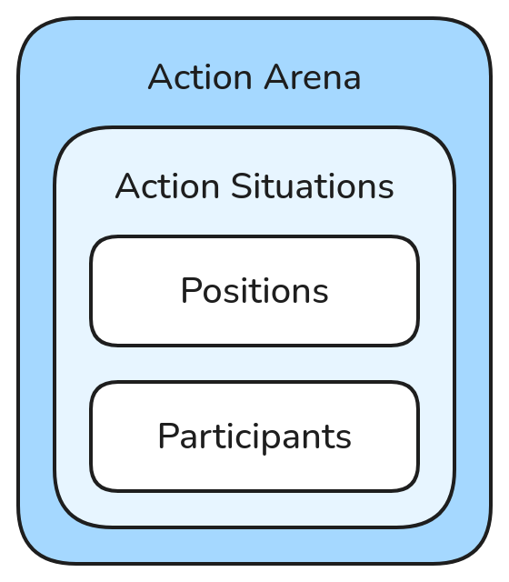
    <figcaption><strong>Figure 4. </strong>The IAD Action Arena elements relevant to position systems. <a href="/excalidraw/1_ActionArena.excalidraw">Source 🗡️</a></figcaption>
</figure>

### 1.3 Rules: Boundary and Position 
But where did the positions come from? And how did the participants get to hold theirs? The IAD framework defines a region outside of the Action Arena it calls _Exogenous Variables_.[^exoVar] This region contains three elements that systematically affect a given Action Arena, and all the Action Situations within it:
1. the physical and biological conditions of the environment
2. the culture of the community, and 
3. the rules in use

While all elements are significant, rules are most clearly in conscious control of the participants determine position systems. The IAD has seven rules categories, one corresponding to each of the Action Situation variables. 

_Position Rules_ correspond to the _Position_ Action Situation variable. They create positions, which Ostrom refers to as "anonymous slots" or "holders" for participants to enter (and exit). Positions are collective fictions which act as bridges between individual people and acceptable actions, turning position holders into members of a political class. Position Rules are restricted to cover _only_ the creation of positions, mostly just naming them, and are therefore "often not by themselves intrinsically interesting"![^UIDpg193]

_Boundary Rules_ correspond to the _Participants_ Action Situation variable. They define who is eligible to hold a position, and how eligible people can enter and exit positions and/or the group. Eligibility often refers to attributes people can't voluntarily change, like age, or location and will not be of further interest here. Rules may be compulsory (such as a defendant in a court case) but are typically voluntary (the participant may chose to enter, if allowed, and exit freely). Rules defining entry may be invitational (if participants may only enter via an extension from existing members) or competitive (if new members are selected by some competition, like a vote). 

<figure>
	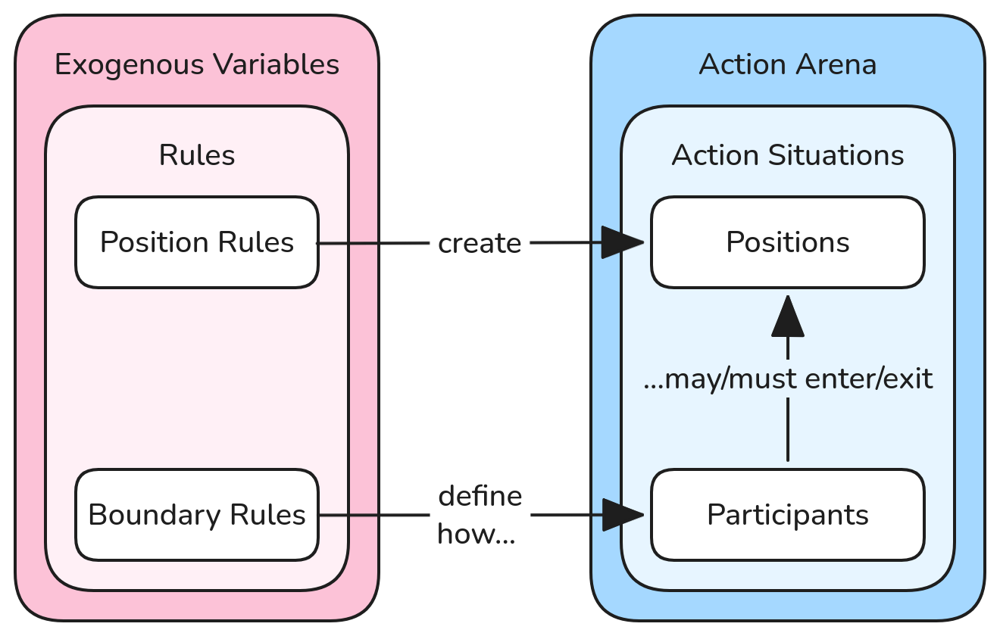
    <figcaption><strong>Figure 5. </strong>All IAD elements relating to position systems. <a href="excalidraw/2_IADextract.excalidraw">Source 🗡️</a></figcaption>
</figure>

### 1.4 Position systems — summary 
Elinor Ostrom & co. developed the Institutional Analysis and Develeopment (IAD) framework to inspect diverse social interactions. It focuses on Action Situations, discrete events of participant interaction, which are situated within an Action Arena. Action Situations have seven internal clusters of variables. Rules, one of three Exogenous Variables, systematically affect the Action Situations, with one category of rules for each variable. Position Rules create positions and Boundary Rules define how participants can enter and exit those positions.

## 2 Statecharts 
Now we turn to computers. I did not study computer science, and only heard about statecharts from a passing comment. But the more I looked into them and the state machines they depict, the more I became convinced they weren't too complicated — and a perfect match for position systems.

### 2.1 State machines: states and transitions 
State machines are abstract models of system behaviour first introduced by Claude Shannon in _A Mathematical Theory of Communication_ (1948). They are composed of only two elements:
1. _states_ -  stable patterns of behaviour, and
2. _transitions_ - transient events that shift the system from one state to another

A state machine can be used to model a system at different levels. It forces modellers to explore the possible states of the system in question, and in doing so identify unintended or troublesome situations.

### 2.2 State diagrams — and explosions 
State diagrams are graphs depicting state machines where states are displayed as nodes (i.e. boxes) and transitions as directed edges (i.e. arrows.) A state diagram for a light switch could be:

<figure>
	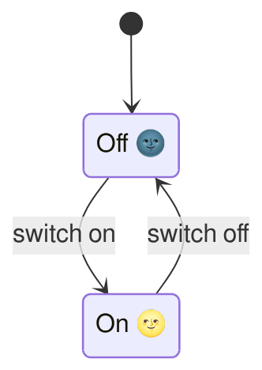
    <figcaption><strong>Figure 6. </strong>State diagram of a light. <a href="/mermaid/2_Light.mermaid">Source 🧜</a> </figcaption>
</figure>

The black-filled circle in the above diagram represents an _initial pseudostate_, a symbol to indicate where the state machine starts. 

OK, so no one really needed a diagram for a light switch. Here's a more complex state diagram for a fan which blows constantly when switched on, and can then be toggled to an "auto" mode:

<figure>
	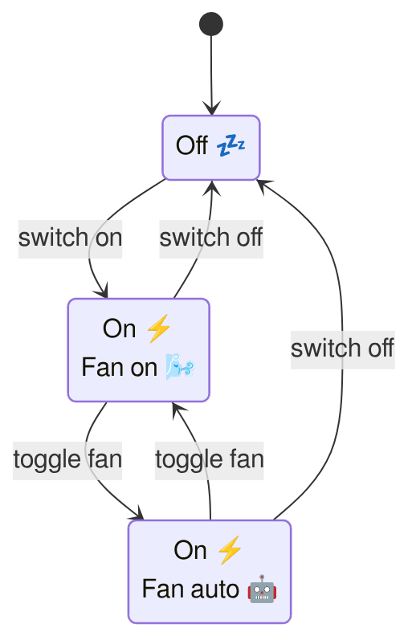
    <figcaption><strong>Figure 7. </strong>State diagram of a fan. <a href="mermaid/3_Fan.mermaid">Source 🧜</a></figcaption>
</figure>

The issue with state diagrams like these is that they quickly get unreadable with more complex systems. To demonstrate this, let's extend the fan example to an air-conditioner which can heat or cool in either fan mode:

<figure>
	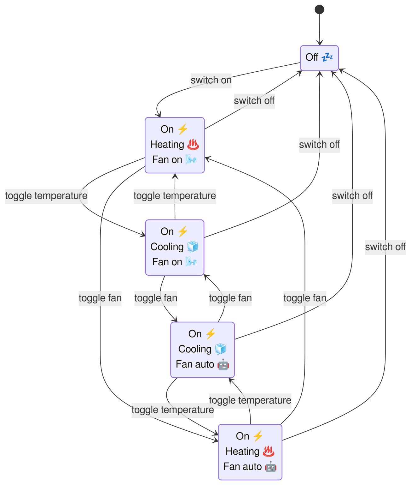
    <figcaption><strong>Figure 8. </strong>State diagram of an air conditioner. <a href="mermaid/4_AirConditioner.mermaid">Source 🧜</a></figcaption>
</figure>

The addition of one extra mode doubled the number of active states. If "beep/silent" mode was further added, the number of active states would again double to 8, and so on. The phenomenon of up-to-exponential increase in states and transitions is known as _state explosion._

### 2.3 Statecharts: hierarchy and concurrency 
The issues with the initial state diagrams for anything more than simple systems became widely known. In 1987, David Harel published the paper _Statecharts: A visual formalism for complex systems_ in which he elaborated on the issues of state diagrams arranged in a "‘flat’ unstratified fashion", then went on to present a set of extensions to "transform the language of state diagrams into a highly structured and economical description language" which he differentiated as _statecharts._

We'll look at those extensions by returning to the air-conditioner. The first major statechart element is hierarchy (a.k.a. depth or nesting.) This is hierarchy in a technical sense, not a social one, and describes the relations between states. If a state is only reachable through another state, it is a substate or child state of the first state (it's superstate or parent state). Substates are depicted as boxes within their respective superstate.

With the air-conditioner, all of the active states require the machine to first be switched "On", and from all active states can it be switched "Off". We can thus separate "On" as a parent state for all the active states, and nest them under it:

<figure>
	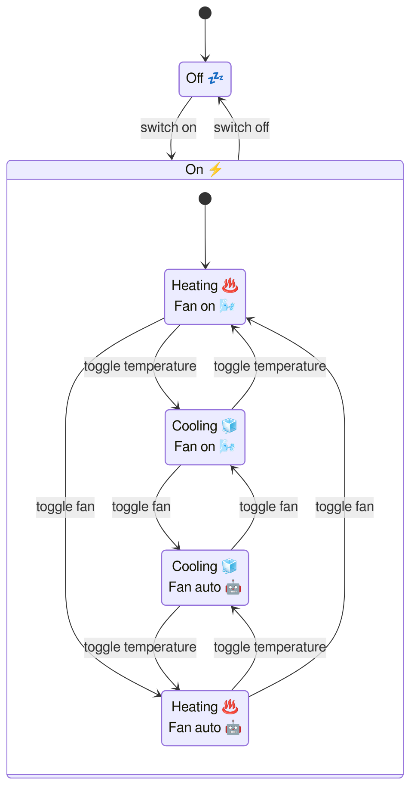
    <figcaption><strong>Figure 9. </strong>State diagram of an air conditioner with hierarchy element. <a href="mermaid/5_AirConditioner+hierarchy.mermaid">Source 🧜</a></figcaption>
</figure>

The second major element of statecharts is concurrency (a.k.a orthogonality or parallelism.) This refers to the ability for subsystems or sub-machines to run at the same time, in parallel. Concurrent subsystems are depicted as regions divided by a dashed line within their respective parent state. Important to note is that all subsystems start immediately when their respective superstate is entered.

Since "temperature" and "fan" modes of the air conditioner run simultaneously and can be toggled independently, they are more accurately modeled as 2 parallel subsystems within the "On" state:

<figure>
	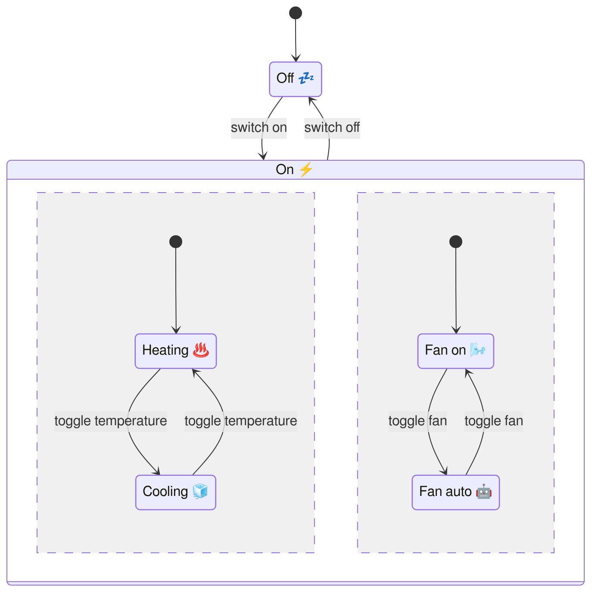
    <figcaption><strong>Figure 10. </strong>Statechart of an air conditioner demonstrating both hierarchy and concurrency elements. <a href="mermaid/6_AirConditioner_statechart.mermaid">Source 🧜</a></figcaption>
</figure>

While the use of hierarchy and concurrency increase the number of boxes in this example, the number of arrows significantly decreases and the reduced visual complexity is self-evident.

### 2.4 UML: development and standardisation 
The extensions set out in Harel's paper were influential. The next years saw a boom in computational diagram methodologies including state diagrams, sequence diagrams, activity diagrams, class diagrams, etc. The diversity of diagrams created communication issues.

To try and standardise things, a consortium of major tech companies was founded in 1989 called the Object Management Group (yes, really: OMG.) In 1997 OMG adopted the then newly created Universal Modelling Language (UML) standard. UML aimed not only to bring standardisation to different technical diagram methods, but to also maximise the coherence between those diagram types. With the consortium's backing, UML was published as [ISO/IEC 19501](https://www.iso.org/standard/32620.html) in 2005. Although its popularity has waned, UML remains hegemonic in the diagramming world.[^UMLpopularity]

<figure>
	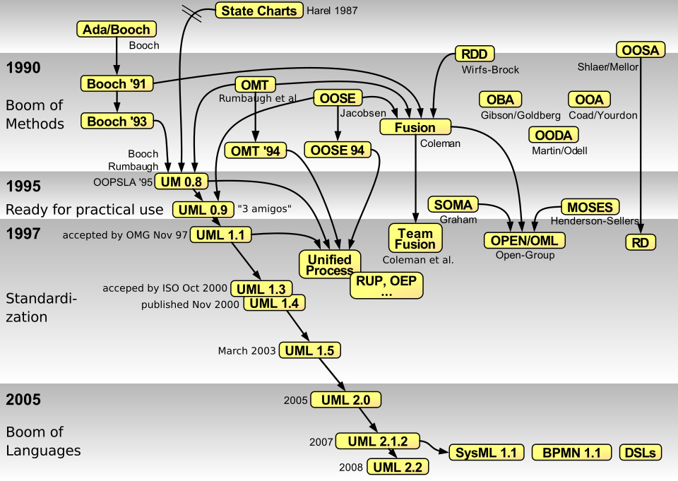
    <figcaption><strong>Figure 11. </strong>"History of Object-Oriented Modeling languages." Guido Zockoll, Axel Scheithauer & Karland90 (CC-BY-SA-4.0) <a href="https://commons.wikimedia.org/wiki/File:OO_Modeling_languages_history.svg"> Wikimedia commons</a></figcaption>
</figure>

UML state diagrams are mostly identical to the statecharts defined by Harel.[^stateDiagramNames] One difference worth highlighting is the use of a diamond for "choice" pseudostates. As the name implies, choice pseudostates are not states (the state-machine cannot "rest" at them) but are rather a conceptual and visual aid to show that several transitions are linked as the result of some choice. Harel had originally proposed a "C-in-a-circle" symbol for what he called "conditional" pseudostates. The diamond adopted by UML leans into the popularity of flowcharts, where the diamond is used to indicate a decision.

<figure>
	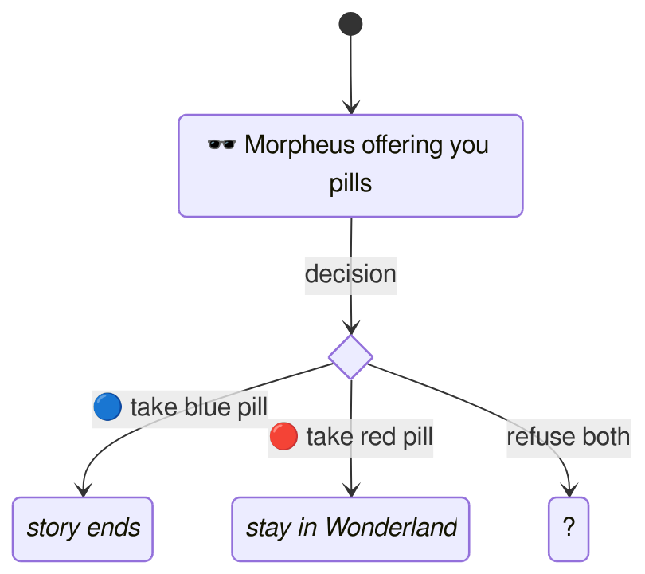
    <figcaption><strong>Figure 12. </strong>Statechart with UML-style choice/conditional pseudostate. <a href="mermaid/7_Morpheus-pill-offer.mermaid">Source 🧜</a></figcaption>
</figure>

### 2.5 Statecharts summary 
State machines are a model from computer science used to describe the states a system can be in and the transitions between those states. Early state diagrams only had elements for "flat" states, meaning that diagrams for more complex systems rapidly became unreadable due to state explosion. David Harel published an influential paper in 1987 presenting statecharts: a set of extensions bringing hierarchy, concurrency and other elements to state diagrams. UML developed state diagrams heavily inspired by statecharts, which became an international standard.

## 3 Position statecharts 
The rest of this article rests on the following 3 claims:
1. that _positions_ (as defined by IAD Position Rules) can be modelled as _states_ in a state machine, and;
2. that _entry into or exit from positions_ (as defined by IAD Boundary Rules) can be modelled as _transitions_ in a state machine, and therefore;
3. that _position systems_ can be modelled as _state machines_ and graphically depicted as _statecharts_

### 3.1 Seeing like a state machine
Describing a position system with the constraints imposed by state machines can be challenging. The first challenge is finding an appropriate way of looking at things, because it is not so clear how a person entering a position is like a light being switched on.[^slasm]

One way of looking that might help is by thinking of a board game, say Monopoly. Each player's figure starting position is "Go" (initial state.) With every turn, a player rolls the dice and moves their figure (transition) to the relevant position (next state).

Another way, arguably more useful, is to think of entering and moving around a house. You start outside (initial state) and when you use the right door code and enter the house (transition), you are immediately and simultaneously inside the house, on the ground floor and in the entrance (next state(s)).

### 3.2 Defining requirements 
I set out to make a position statechart for Kanthaus with the aim of describing the position system as clearly and comprehensively as possible. But when I got started, this turned out not to be so easy.

Firstly, there are many different free (and open-source) tools for generating statecharts, each offering enticing features. If you are like me, your wide eyes may slowly lead to aim-creep unless you are very clear about what is required and what is simply nice-to-have. After spending too many hours going round in circles, I realised that none of the newly discovered features were requirements.

Secondly, I rediscovered that clarity and completeness may be conflicting. Even though statecharts manage to present information far more clearly than the initial state diagrams, things still get confusing when arrows start to cross and are there are too many boxes. I ended up deciding not to show some of the less important transitions on the statechart, but rather explain them in a note beside.

My final requirements were to make a statechart:
* that describes the entire position system
* that explicitly depicts all positions and all major transitions
* that would fit as nicely as possible onto A4 paper
* that is as clear as possible, beautiful as a bonus

### 3.3 Tools for prototyping 
Here I will recommend two tools for prototyping before getting started. More tools are discussed later on.

The first is pen and paper. While you have to do all the work yourself - no copy or paste - there are also no limitations to your creative urges. The directness of drawing by hand engages a completely different part of my mind than anything intermediated by a keyboard. Through my process, I scrawled over at least 6 sides of A4 and 1 envelope.

<figure>
	
    <figcaption><strong>Figure 13. </strong>One of the many pages I filled with sketches.</figcaption>
</figure>

The second is Mermaid: a notation language for state diagrams as well as a javascript library for rendering them, conveniently available as a [webapp](https://mermaid.ai/live) — all free and open-source. All of the diagrams in this article with curved arrows were made with it. The notation is relatively straightforward and described in detail in their [guide](https://mermaid.ai/open-source/syntax/stateDiagram.html), but to give one small example, here is the notation that was used to generate the first mermaid diagram of the light switch:

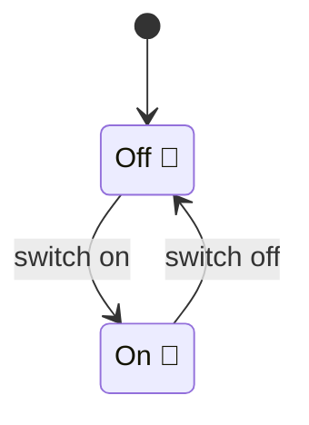
```mermaid
stateDiagram-v2
    [*]
    state "Off 🌚" as Off
    state "On 🌝" as On

    [*] --> Off
    Off --> On : switch on
    On --> Off : switch off
```

Mermaid engaged a completely different part of my mind than drawing: not only by being constrained by the notation, but also that the generated diagrams had unexpectedly different layouts. The latter was initially quite frustrating, but when I accepted I was only prototyping, I found being forced to engage with different perspectives quite helpful. 

For me, the use of both pen & paper and mermaid was quite illuminating, and I recall several points of confusion I was only able to disentangle through using both. 

### 3.4 Basic position statechart 
One can zoom in or out of a system to describe it at any level of detail. Here I will go through the creation of a "basic" statechart, one that goes into only enough detail to describe the whole system broadly.

Identifying all relevant states is arguably the core of the exercise. Perhaps your organisation has only one position (e.g. "part of the group") in which case you will have a relatively simple statechart. The Kanthaus constitution explicitly specifies 3 positions: Visitor, Volunteer and Member. Each of these positions is a distinct state.

<figure>
	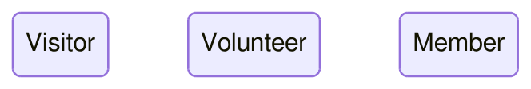
    <figcaption><strong>Figure 14. </strong>The 3 Kanthaus positions: Visitor, Volunteer and Member. <a href="mermaid/8_Kanthaus_Visitor_base.mermaid">Source 🧜</a></figcaption>
</figure>

Anyone who holds one of these positions is also "in" Kanthaus, which although not explicitly mentioned in the constitution is at least a nominal group. The positions may be associated through an organisation superstate.

<figure>
	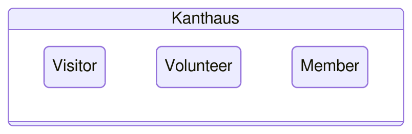
    <figcaption><strong>Figure 15. </strong>The Kanthaus positions nested within the organisation. <a href="mermaid/9_Kanthaus_positions-grouped.mermaid">Source 🧜</a></figcaption>
</figure>

But how does someone get in? The transition from "outsider" to "insider" is perhaps the most important one, and requires the explicit recognition of a "non-position" state:

<figure>
	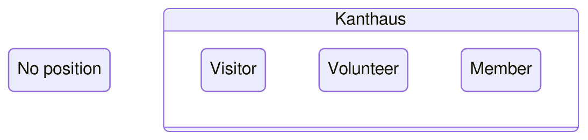
    <figcaption><strong>Figure 16. </strong>Explicit recognition of person without organisational position. <a href="mermaid/10_Kanthaus_positions-grouped+non.mermaid">Source 🧜</a></figcaption>
</figure>

At this point, all states are accounted for. The next step is to add all state transitions, including the initial pseudostate and its transition. It helped me to really focus on one position at a time, and exhaustively note all outgoing transitions from that position.

<figure>
	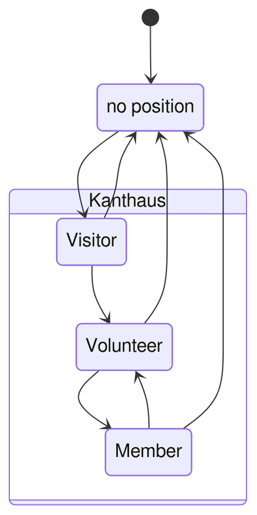
    <figcaption><strong>Figure 18. </strong>All position transitions. <a href="mermaid/11_Kanthaus_Position-Statechart_basic.mermaid">Source 🧜</a></figcaption>
</figure>

A basic position position statechart is achieved by then labelling the transitions:

<figure>
	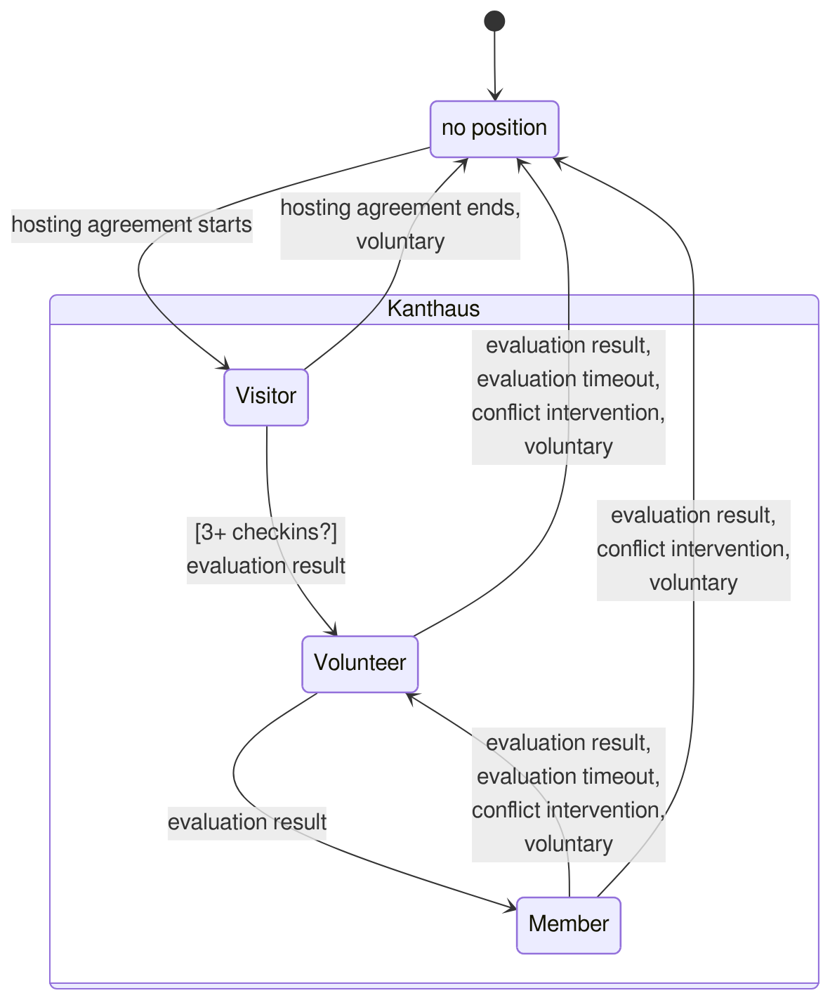
    <figcaption><strong>Figure 19. </strong>Basic Kanthaus position statechart. <a href="mermaid/12_Kanthaus_Position-Statechart_basic+labeled.mermaid">Source 🧜</a></figcaption>
</figure>

### 3.5 Advanced position statechart 
The statechart above, while comprehensive, obscures many details. To create a statechart that accounts for these details, it is necessary to descend into the position states and identify substates and transitions within them. As I said in the requirements section, I will only show _major_ transitions, which in the case of Kanthaus means leaving out voluntary downward/outwards transitions and those resulting from conflict resolution interventions (the latter only happening a couple of times over almost 10 years).

The position of Member is in fact the least complex, so we'll start there. A central procedure in the Kanthaus position system is the _evaluation_, a periodic appraisal through which community members determine the appropriate position for the person in question to continue with. A Member becomes due for evaluation 180 days after becoming a member, which can be modelled with the substate "due for evaluation". Before this, the Member can be considered to be in the a "default" substate. Substates can be thus used to model position _attributes_.

<figure>
	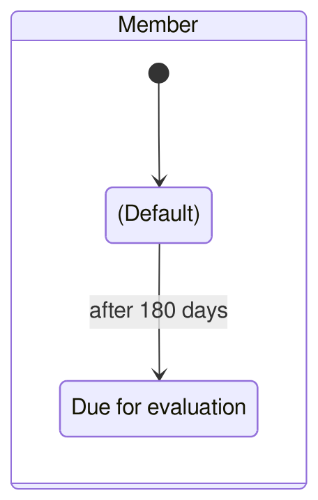
    <figcaption><strong>Figure 20. </strong>Member position substates. <a href="mermaid/13_Kanthaus_Member_base.mermaid">Source 🧜</a></figcaption>
</figure>

At their evaluation, a Member can apply to remain a Member or become a Volunteer or Visitor. The evaluation procedure itself determines the result through a vote of the other current members. If accepted as a Member, they reenter the "default" substate and the countdown starts again. If accepted as a Volunteer, they leave the Member position altogether and become a Volunteer. If accepted as a Visitor, they enter the "no Kanthaus position" state: this is because the Visitor position is determined exclusively by being hosted. (If before the end of the evaluation someone is willing to host, the person would instantaneously transition through "no Kanthaus position" to the Visitor position.)

<figure>
	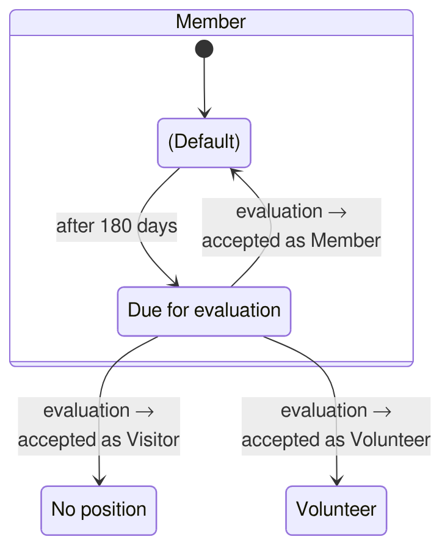
    <figcaption><strong>Figure 21. </strong>Member transitions arising from different evaluation outcomes. <a href="mermaid/14_Kanthaus_Member+evaluation.mermaid">Source 🧜</a></figcaption>
</figure>

The evaluation and its outcomes have a clearer visual association by using the choice pseudostate:

<figure>
	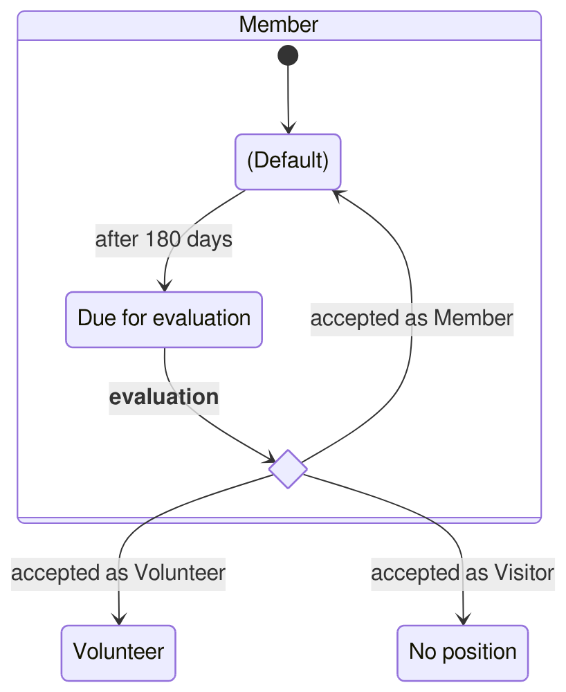
    <figcaption><strong>Figure 22. </strong>Member evaluation transitions grouped with choice pseudostate. <a href="mermaid/15_Kanthaus_Member+evaluation-choice.mermaid">Source 🧜</a></figcaption>
</figure>

Additionally, if a Member does not have an evaluation within 365 days since (re)entering the position they timeout, becoming a Volunteer. This completes a detailed view of the Member position.

<figure>
	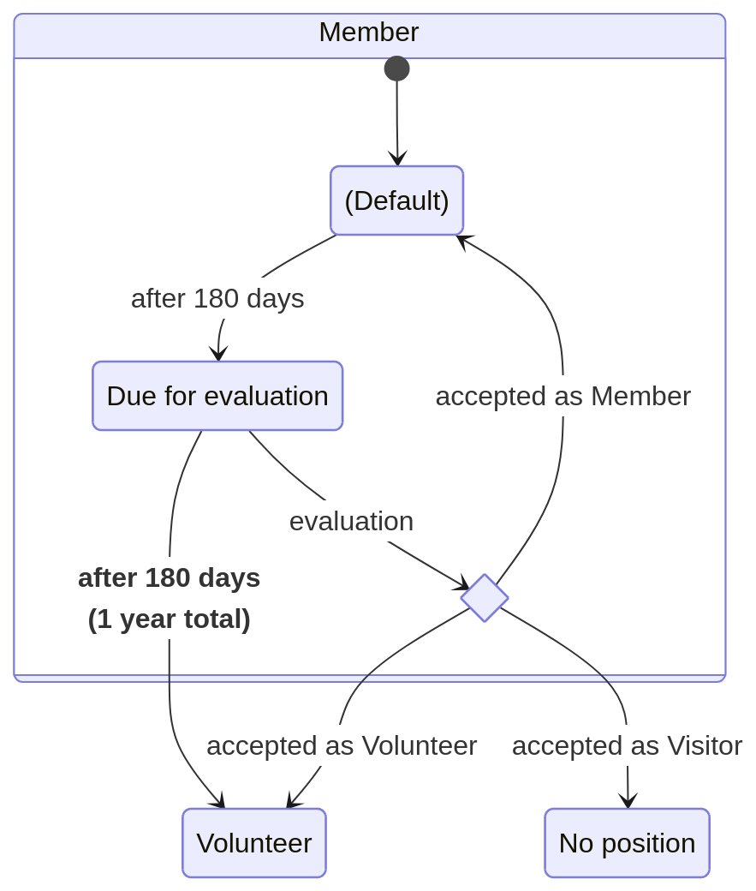
    <figcaption><strong>Figure 23. </strong>Full description of member state, including evaluation timeout. <a href="mermaid/16_Kanthaus_Member_full.mermaid">Source 🧜</a></figcaption>
</figure>

The Volunteer position operates quite similarly to Member, with different evaluation time periods. The Visitor position is however quite different. It is entered not via evaluation, but via hosting - this is when a Volunteer or Member agrees to take over technical and social responsibility for onboarding the person into the community. Should this agreement end for whatever reason, the position is lost. To keep up communication between the Visitor, Host and other community members, a checkin is due after every seven days. The checkin has no hard timeout, unlike evaluations, and therefore no formal impact on position.

<figure>
	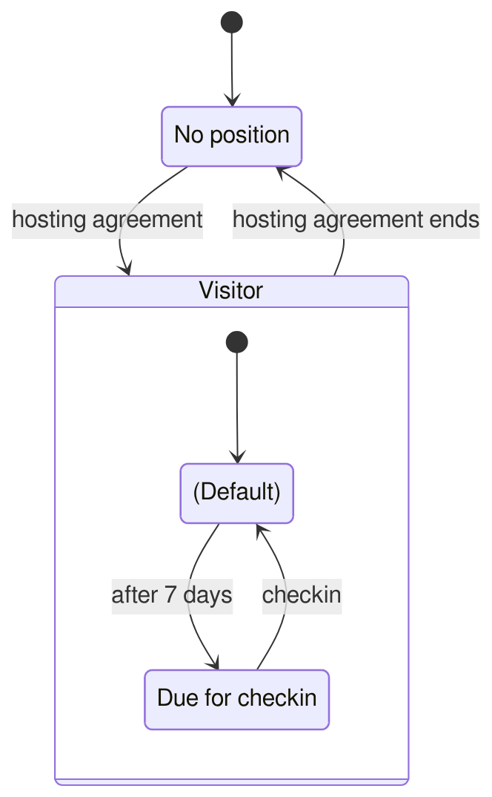
    <figcaption><strong>Figure 24. </strong>Visitor position entry/exit and substates. <a href="mermaid/17_Kanthaus_Visitor_base.mermaid">Source 🧜</a></figcaption>
</figure>

After having completed 3 checkins, the Visitor is eligible for evaluation and may choose to have one at any point going forwards. At their evaluation they may apply to continue as a Visitor or become a Volunteer.

<figure>
	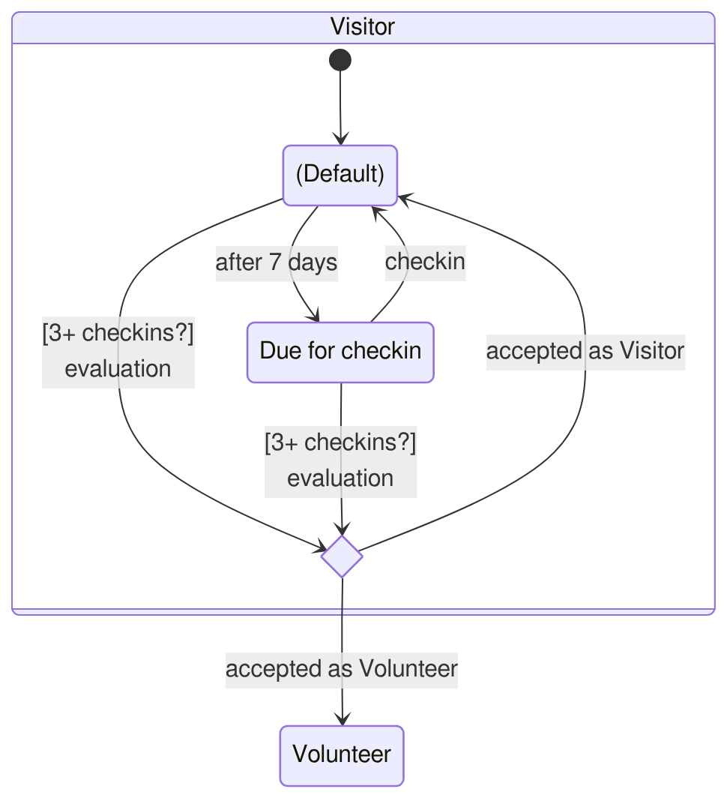
    <figcaption><strong>Figure 25. </strong>Complete Visitor position. <a href="mermaid/18_Kanthaus_Visitor_full.mermaid">Source 🧜</a></figcaption>
</figure>

It would be an option to use the concurrency element within the Visitor state to deal with checkins and evaluation separately. (This is noticeable since 2 transitions have the identical event "[3+ checkins?] evaluation" and end on the same state.)

<figure>
	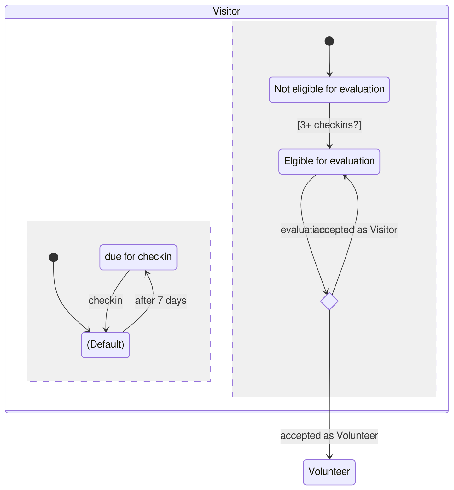
    <figcaption><strong>Figure 26. </strong>Complete Visitor position, using concurrency. <a href="mermaid/19_Kanthaus_Visitor_full-concurrent.mermaid">Source 🧜</a></figcaption>
</figure>

Ultimately I decided against the concurrent representation.[^thankTimber] My impression is that hierarchy and its nested box representation are far more intuitive than concurrency and its representation. Using concurrency would have made the statechart more complex altogether, which goes against requirements.

Applying this more detailed view of the Volunteer position and bringing the system together results in an much more advanced statechart:

<figure>
	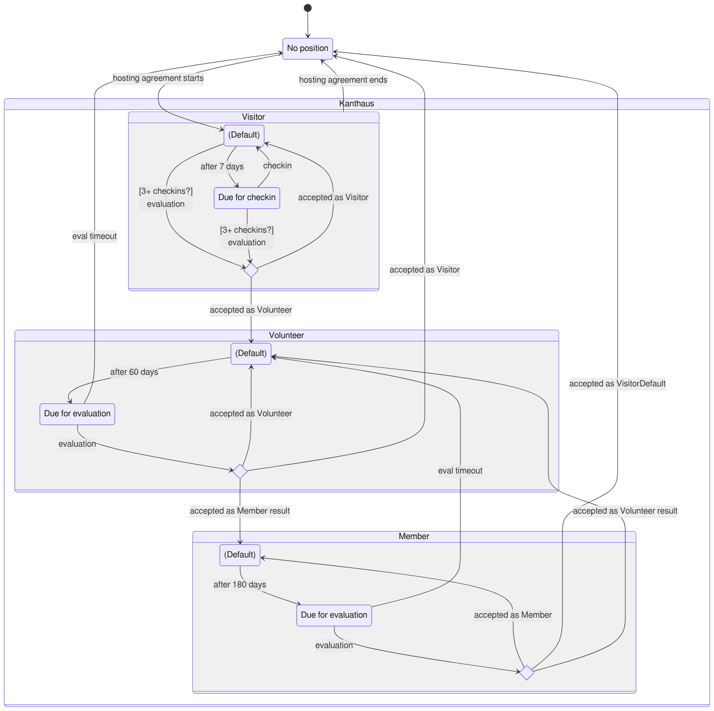
    <figcaption><strong>Figure 27. </strong>Advanced Kanthaus position statechart. <a href="mermaid/20_Kanthaus_Position-Statechart_advanced.mermaid">Source 🧜</a></figcaption>
</figure>

### 3.6 Tools for finalising 
The statechart above leaves a lot to be desired. I count at least two unnecessary arrow overlaps, and it is generally quite ugly. Here I will briefly cover some options for finalising a statechart, including the one I used to create the statechart at the beginning of the article. What constitutes 'final' is contingent on your requirements and preferences. (Perhaps the result of your prototyping is already satisfactory.)

In general, there are two approaches: generating (like with mermaid) or drawing (by hand or digitally.)

There are many statechart generators[^generators] all requiring the statechart to be described with some particular notation. This article has looked at mermaid which has fairly simple notation that is shared with some other tools (notably [PlantUML](https://plantuml.com/), upon which it is based). There is also a W3C standard for statechart notation, [SCXML](https://www.w3.org/TR/scxml/), but few tools support it and it is not easy to write. Most tools use their own Domain Specific Language (DSL), a unique notation intended for that tool only.

Once the generator has parsed the notation, it will use some layout algorithm to decide where to place state boxes and direct transition arrows. Mermaid uses the popular [Dagre](https://github.com/dagrejs/dagre) algorithm by default, the results of which you see in most of the generated diagrams in this article. It's tried and tested and produces curved arrows which often unnecessarily overlap. Another increasingly popular layout algorithm is [ELK](https://eclipse.dev/elk/), which gives angled arrows that avoid overlapping at all costs and creates a generally different box layout. Some tools allow the selection of different layout algorithms (e.g. mermaid [also supports ELK](https://mermaid.js.org/intro/syntax-reference.html#selecting-layout-algorithms).) 

<figure>
	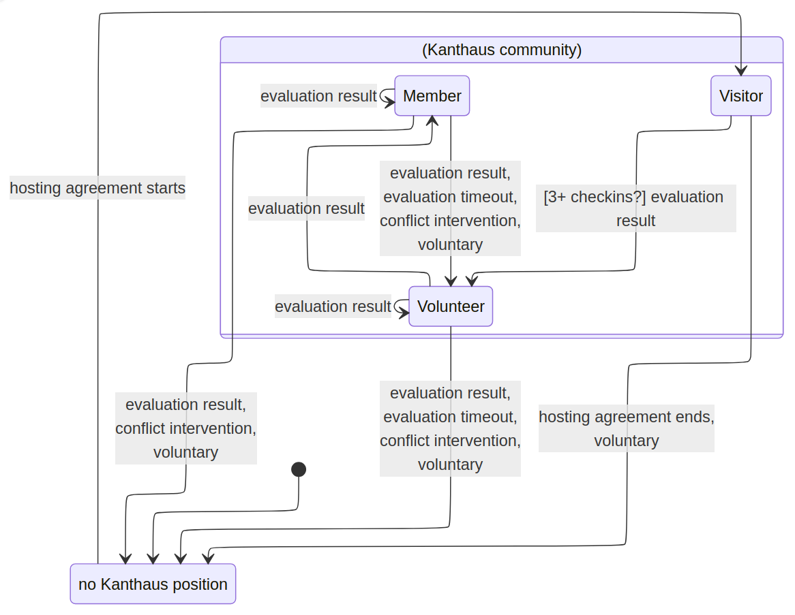
    <figcaption><strong>Figure 28. </strong>Basic Kanthaus position statechart (Figure 11.) layed out using ELK instead of Dagre.</figcaption>
</figure>

I spent a lot of time trying out different generators, tweaking options and switching layout algorithms to try and get the result I was looking for, which often came close but remained frustratingly out of reach. This lead me to understand that layout is a fundamentally hard problem. What if it is important that two particular boxes are on the same level? Or that certain arrows go in certain directions? There are some ways to pass this information to some generators, but when I realised this would pretty much mean coding a diagram, I realised I would rather _draw_ one.

In comparison, my search for an appropriate drawing tool was much simpler, despite there being many more options. I didn't really consider hand-drawing, on account of editing and reproduction costs being so high. I then looked at the venerable [Inkscape](https://inkscape.org), my go-to for all things visual, but I found the connector tool a little clunky and realised that Inkscape was generally overkill. Then I turned to [Excalidraw](https://excalidraw.com/), a very nicely designed whiteboard webapp I've used to make other diagrams in the past. Excalidraw has almost perfect feature constraint for creating statecharts very quickly. I created the statechart at the beginning of the article using Excalidraw, and it took a fraction of the time I'd spent on generators.

## Conclusion
Position statecharts make position systems more accessible and can contribute to more coherent, fair and sustainable governance. The constaint of describing a system as a state machine brings a simplicity and therefore clarity. Yet there may be situations where breaking that constraint is worth it. In situations where holding multiple formal positions simultaneously is the default, a different paradigm may be more fitting (such as "circles" diagrams in Sociocracy.)

Thanks for reading, get in touch if you have questions or ideas. Happy charting!

## Disclaimers
I received no money or other renumeration for writing this. I am not a member of any of the groups making the software I mentioned although I have had some friendly interactions. The only things generated in this article were the mermaid diagram: old-school, deterministic generation. Oh, and structure is necessary but _not sufficient_ for good governance.

## References
* Freeman, J. (1972). The Tyranny of Structurelessness. _Berkeley Journal of Sociology_, _17_, 151–164. http://www.jstor.org/stable/41035187
* Hardin, G. (1968). The Tragedy of the Commons: The population problem has no technical solution; it requires a fundamental extension in morality. _Science_, _162_(3859), 1243–1248. https://doi.org/10.1126/science.162.3859.1243
* Harel, D. (1987). Statecharts: A visual formalism for complex systems. _Science of Computer Programming_, _8_(3), 231–274. https://doi.org/10.1016/0167-6423(87)90035-9
* Object Management Group. (2017). _Unified Modeling Language, Version 2.5.1_. https://www.omg.org/spec/UML/
* Ostrom, E. (1990). _Governing the commons: The evolution of institutions for collective action_. Cambridge University Press. https://doi.org/10.1017/CBO9780511807763
* Ostrom, E. (2005). _Understanding institutional diversity_. Princeton Univ. Press. https://doi.org/10.2307/j.ctt7s7wm
* Polletta, F. (2002). _Freedom is an endless meeting: Democracy in American social movements_. University of Chicago Press. https://doi.org/10.7208/chicago/9780226924281.001.0001
* Scott, J. C. (1998). _Seeing Like a State: How Certain Schemes to Improve the Human Condition Have Failed_. Yale University Press. https://doi.org/10.2307/j.ctvxkn7ds
* Shannon, C. E. (1948). A Mathematical Theory of Communication. _Bell System Technical Journal_, _27_(3), 379–423. https://doi.org/10.1002/j.1538-7305.1948.tb01338.x

<!-- ## Footnotes <-- automatically generated! -->
[^inspirationOuborous]: Funnily enough, when I wrote David to ask if I could publish his diagram, he claimed he was inspired by something I had said earlier... an inspiration Ouroboros.
[^prizeTechnicality]: The fortune Alfred Nobel amassed through the invention, development and sales of explosives and armaments only established 5 prizes. In 1968 the Bank of Sweden donated a large sum of money to establish a separate prize for Economics in his memory.
[^ToC]: This trend can be partly attributed to the massive impact of Garrett Hardin's _The Tragedy of the Commons_ (1968). Ostrom met with and debated Hardin, and her _Governing the Commons_ is in part a refutation of his paper.
[^UIDpg3]: _Understanding institutional diversity_, pg. 3
[^UIDpg5]: _Understanding institutional diversity_, pg. 5
[^UIDpg193]: _Understanding institutional diversity_, pg. 193
[^exoVar]: "Exogenous" to the the Action Arena, that is. Still, a bit confusing. In my mind I rename them _system variables_.
[^thankTimber]: This is thanks to Timber. I was excited to use all the statechart elements; they wisely recommended me not to.
[^generators]: See the comprehensive lists on https://modeling-languages.com/ as well as the 'awesome finite state machines' list on GitHub https://github.com/leonardomso/awesome-fsm 
[^actions]: The Action Situation variable _Actions_ covers the things that holders of a given position are legally allowed or required to do. This is something usually bundled into the concept of positions, but the IAD deliberately abstracts the identity of a position from its attributes. (A visualisation of Actions (as defined by their accompanying _Choice Rules_) can be adequately achieved with a table such as this example for Kanthaus positions: https://wiki.kanthaus.online/Position_attributes_table)
[^stateDiagramNames]: The naming gets a bit confusing. So, _state diagrams_ are used to refer to the initial diagram method which suffers from state (and transition) explosion. Harel coined the term _statechart_ to recognise the significant differences which he'd made, which preserving "state" in the name. UML chose to use _state diagram_ to refer to the extended state diagram, pretty much what Harel called _statechart_. It seems that the initial state diagram is not really used any more, so it's presumably not confusing for those in the industry. I chose to stick with _statechart_ primary because I think it sounds cooler... and I like that it has a navigational feeling.
[^UMLpopularity]: UML is here to stay, but it's popularity has waned since the 2000's. Several of the people who worked deeply on it published articles reflecting why, mentioned in this Mermaid blog post: https://mermaid.ai/blog/posts/sequence-diagrams-the-good-thing-uml-brought-to-software-development. The overlapping point they make is that UML, in an attempt to be _universal_, got too complex. UML Version 2.2 was over 1000 pages long, with the bulk of volume covering niche cases that were mostly not encountered. And since few diagram tools managed to implement all aspects of the standard exactly, each one essentially developed a different flavour of the standard... See <a href="https://xkcd.com/927/">xkcd 927</a>
[^slasm]: The title of this section is a half-joke made after James C. Scott's _Seeing like a state_. He looks at how nation states' efforts to control their domain has typically lead them to try and standardise things, including their subjects, often with significant coercion. Considering a position system as a state machine could induce a desire to simplify things.