#statechart #kh 

`Version 1.0.0 (2026-06-??)`
* 2026-06-15: 🦇
* 2026-06-16: 🦜
* 2026-06-17: 🐟
* 2026-06-18: 🦞

## Abstract
The power and responsibility one has in a situation is formalised by ones position within it; positions and the ways of entering/exiting them — _position systems_ — are thus a foundational governance concern. Constitutional ambiguities may remain hidden and newcomer empowerment may be obstructed if a position system is not clearly understood. This article is motivated by the desire to make such information more easily understandable through visualisation with appropriate diagrams. To establish a grounded understanding of position systems and their context within governance, the Institutional Analysis and Development framework is consulted. The state machine model, which represents system behaviour as states and transitions, is considered as a potential candidate for position systems. The argument is made that position system can be modelled as state machines, with positions and their entry/exit events being mappable onto states and transitions, respectively. State diagrams and their extension to statecharts are therefore well-suited for position systems. The planning and production of such a position statechart for a real-life case using pen & paper and free and open-source software is demonstrated.

<figure>
	
    <figcaption>Fig. X — Position statechart of Kanthaus</figcaption>
</figure>

## Introduction 🦇🦜
In 2025 I initiated a change to the [Kanthaus constitution](https://git.kanthaus.online/kanthaus/kanthaus-governance/src/branch/master/documents/constitution/constitution.en.md) to try and solve some long-standing issues with the system of positions it defines. ([Kanthaus](https://kanthaus.online) is a residential action centre, a project house, that I co-founded in 2017.) During the accompanying discussion, David posted a "state/flow chart" they made:

<figure>
	
    <figcaption>Fig. X — David's state/flow chart of the Kanthaus position system</figcaption>
</figure>

I had made vague sketches in that direction in the past, but nothing so comprehensive. The chart highlighted some ambiguities in the constitution text: what status does a person have who goes into an evaluation as a Volunteer, is accepted as a Visitor, but no one agrees to host them? Without conclusively resolving every issue, we came to a good-enough consensus and changed the constitution. David's diagram sank into memory.

Then, about a month ago, I went to friend's doctoral defence. As the debate on the philosophy and history of ideas washed over me, I leafed through a hard-copy of the thesis. The utility of diagrams sprang back into my attention when I read, and re-read:

> It is important to note that all Young Hegelians were Left Hegelians, however, not all Left Hegelians were Young Hegelians.

While I understand such claims as text, it takes noticeable effort. In comparison, an equivalent diagram, in this case an Euler diagram, feels almost effortless:


And with that prompt, David's chart and the difficulty of comprehending the constitution came back to haunt me.[^inspirationOuborous]

The need for governance to be clear and transparent is made on egalitarian grounds by Jo Freeman in _The Tyranny of Structurelessness_ (1972). In her reflection on the US feminist movement, Freeman describes the movement's rejection of formal governance ("structure") as a reaction to the over-structured society many women found themselves dispossessed by. While this approach did have some liberatory effects, the outright refusal to make _de facto_ structures transparent ultimately contributed to the accumulation of power in more experienced members and the formation of elites. The economic and ecological necessity of clear, transparent governance would be empirically justified some time later by Elinor Ostrom in _Governing the Commons_ (1990), which we'll come back to shortly.

History and theory aside, anyone who's done any amount of organising will simply _know_ how critical it is that everyone knows the rules. While text will likely remain the primary medium, could accessibility and comprehension be improved through visualisations? I say _yes_. This article will limit its scope to visualising positions and the movements in and out of them. An overview:
* **Part 1: Positions** - considers the identity and attributes of positions through Ostrom's Institutional Analysis and Development framework
* **Part 2: Statecharts** - introduces state machines and the development of graphical depictions thereof, particularly Harel's statecharts.
* **Part 3: Position statecharts** - practically demonstrates with examples how statecharts can be constructed for position systems.

## 1. Position systems 🦜
I use the term _position system_ to refer to the set of roles available to people in some context and also the procedures for people to enter and exit them. While hopefully intuitive, some people have spent a lot of time and effort doing foundational work on this topic which is worth knowing about. 

### 1.1. Ostrom and the IAD 🦇🦜
In 2009 Elinor Ostrom was the first woman to (co-)win the Nobel Memorial Prize for Economics[^prizeTechnicality] "for her analysis of economic governance, especially the commons".[^ostromNobel] _Common-pool resources_, extensive resources like forests and fishing grounds, were the focus of this work.

Through decades of study and meta-study (culminating in _Governing the Commons_) she conclusively demonstrated that people can and do successfully self-organise to share large, natural resources sustainably without state management or privatisation. I hope you don't find that conclusion so surprising, but in the economic debate of the 1970's the _opposite_ idea was ascendant, feeding political narratives to justify distrust in communities and dispossession of indigenous people — and that idea is still alive.[^ToC]

While economics has come to focus on money and markets, Ostrom focused on institutions, which she broadly describes as "the prescriptions that humans use to organise all forms of repetitive and structured interactions".[^UIDpg3] This inclusive understanding includes family structures, government committees and everything in between. It is with the lens of institutionalism she approached all her work, which was not limited to the commons. In her less famous but equally important book, _Understanding Institutional Diversity_ (UID) (2005), Ostrom presented an Institutional Analysis and Development (IAD) framework, synthesised out of years of work to try and identify "universal building blocks"[^UIDpg5] for the incredibly variable institutions we find in our world.

### 1.2. Action situations: Participants and positions 🦜
The IAD framework focuses on Action Arenas and the many Action Situations that occur within them. An Action Arena is a space in which repeated institutional activity takes place. An Action Situation is a discrete interaction event between participants, some slice of day-to-day activity. For example: 

| An Action Arena | An Action Situation in that arena |
| --- | --- |
| A school | The headteacher changes the dress code, making ties now optional. |
| A chatroom | After warning them twice about spamming, a moderator bans a user. |
| A co-housing syndicate | At an assembly, members accept the entry of a new group. |

Inside the Action Situation are seven "clusters of variables", covering the institutionally relevant elements of participant interaction. Of the variables, two are of specific importance to the task at hand, _Positions_ and _Participants._

| Action Situation variable | Description |
| --- | --- |
| _Positions_ | the recognised roles participants could hold |
| _Participants_ | the specific individuals who have entered certain positions |

A further variable, _Actions_ covers the things that holders of a given position are legally allowed or required to do. Although a core aspect of positions, this article restricts it's scope to the above. (A visualisation of Actions can be adequately achieved with a table[^positionAttributesTable].)

<figure>
	
    <figcaption>Fig. X —  A diagram of the IAD Action Arena, the Action Situations located within it and their variables relevant here,  Positions and Participants.</figcaption>
</figure>

### 1.3. Rules: Boundary and Position 🦜
But where did the positions come from? And how did the participants get to hold their positions? The IAD framework defines a region outside of the Action Arena it calls _Exogenous Variables_.[^exoVar] This region contains three elements that systematically affect a given Action Arena, and all the Action Situations within it:
1. the physical and biological conditions of the environment
2. the culture of the community, and 
3. the rules in use

While all elements are significant, rules are most clearly in conscious control of the participants. The IAD has seven categories for rules, with each category corresponding to one of the Action Situation variables.

_Position Rules_ create positions, which Ostrom refers to as "anonymous slots" or "holders" for participants to enter (and exit). These are collective fictions which act as bridges between individual people and acceptable actions, turning position holders into members of a political class. Position Rules are restricted to cover _only_ the creation of positions, mostly just naming them, and are therefore "often not by themselves intrinsically interesting" ![^UIDpg193]

_Boundary Rules_ define who is eligible to hold a position, and how eligible people can enter and exit positions and/or the group. Eligibility often refers to attributes people can't voluntarily change, like age, or location and will not be of further interest here. Rules may be compulsory (such as a defendant in a court case) but are typically voluntary (the participant may chose to enter, if allowed, and exit freely). Rules defining entry may be invitational (if participants may only enter via an extension from existing members) or competitive (if new members are selected by some competition, like a vote). 

<figure>
	
    <figcaption>Fig. X — IAD elements relating to position systems.</figcaption>
</figure>

### 1.4. Position systems summary 🦜
Elinor Ostrom developed the Institutional Analysis and Develeopment (IAD) framework to inspect diverse social interactions. It focuses on Action Situations, discrete events of participant interaction, which are situated within an Action Arena. Action Situations have seven internal clusters of variables. Rules, one of three Exogenous Variables, systematically affect the Action Situations, with one category of rules for each variable. Position Rules create positions and Boundary Rules define how participants can enter and exit those positions. I use the term _position system_ to refer to both together.

--- 

## 2. Statecharts 🦜
Now we turn to computers. I did not study computer science, and only heard about statecharts from a passing comment. But the more I looked into them and the state machines they depict, the more I became convinced they weren't too complicated — and a perfect match for position systems.

### 2.1. State machines: states and transitions 🦜
State machines are abstract models of system behaviour first introduced by Claude Shannon in _A Mathematical Theory of Communication_ (1948). They are fundamentally composed of only two elements:
1. _states_ -  stable patterns of behaviour, and
2. _transitions_ - transient events that shift the system from one state to another

A state machine can be used to model a system at different levels. It forces modellers to explore the possible states of the system in question, and in doing so identify unintended or troublesome situations.

### 2.2. State diagrams — and explosions 🦜
State diagrams are graphs depicting state machines where states are displayed as nodes (i.e. boxes) and transitions as directed edges (i.e. arrows.) A state diagram for a light switch could be:

**— State diagram of a light**

The black-filled circle in the above diagram represents an _initial pseudostate_, a symbol to indicate where the state machine starts. 

OK, no one really needed a model for a light switch. Here's a more complex state diagram for a fan which blows constantly when switched on, and can then be toggled to an "auto" mode:

**— State diagram of a fan**

The issue with state diagrams as originally conceived, is that they quickly get unreadable with more complex systems. To demonstrate this, let's extend the fan to an air-conditioner which can heat or cool in either fan mode:

**— State diagram of an air conditioner**

The addition of one extra mode (heating/cooling) doubled the number of active states. If beep/silent mode was further added, the number of active states would again double to 8, and so on. The phenomenon of up-to-exponentially increasing states is known as state explosion.

### 2.3. Statecharts: hierarchy and concurrency 🦜
The issues with simple state diagrams for anything more than simple systems became widely known. In 1987, David Harel published a paper titled _Statecharts: A visual formalism for complex systems_ in which he elaborates on the issues of state diagrams arranged in a "‘flat’ unstratified fashion". In the paper he presents _statecharts_, a set of extensions to "transform the language of state diagrams into a highly structured and economical description language."

We'll look at those enhancements by returning to the air-conditioner. The first major statechart element is hierarchy (a.k.a. depth, nesting.) This is hierarchy in a technical sense, not a social sense, and describes the relations between states. If a state is only reachable _through_ another state, it is a substate or child state of the first state (a superstate or parent state). Substates are depicted as boxes _within_ their respective superstate.

With the air-conditioner, all of the active states require the machine to first be switched "On", and from all active states can it be switched "Off". We can thus separate "On" as a parent state for all the active states, and nest them under it:

**— State diagram of an air conditioner** with hierarchy element

The second major element of statecharts is concurrency (a.k.a orthogonality, parallelism.) This refers to the ability for subsystems or sub-machines to run at the same time, in parallel. Concurrent subsystems are depicted as regions divided by a dashed line within their respective parent state. Important to note is that all subsystems start immediately when their respective superstate is entered.

Since "temperature" and "fan" modes of the air conditioner run simultaneously and can be toggled independently, they are more accurately modeled as 2 parallel subsystems within the "On" state:

**— Statechart of an air conditioner** demonstrating both hierarchy and concurrency elements

While the use of each element both increase the number of boxes rectangles in this example, the number of arrows significantly decrease and the reduced layout complexity is self-evident.

### 2.4. UML: development and standardisation 🦜
The state diagram elements set out in Harel's paper were influential. In combination with the ascension of the computer, the next years saw a boom in technical diagram methodologies including state diagrams, sequence diagrams, activity diagrams, class diagrams, etc. The diversity of diagrams created communication issues.

To try and standardise things, a consortium of major tech companies was founded in 1989 called the Object Management Group (yes, really: OMG.) In 1997 OMG adopted the then fledgling Universal Modelling Language (UML.) UML aimed not only to bring standardisation to different technical diagram methods, but to also maximise the coherence between those diagram types. With the consortium's backing, UML was published as [ISO/IEC 19501](https://www.iso.org/standard/32620.html) in 2005 cementing its hegemony in the diagramming world. 

<figure>
	
    <figcaption>Fig. X — "History of Object-Oriented Modeling languages." Guido Zockoll, Axel Scheithauer & Karland90 (CC-BY-SA-4.0) <a href="https://commons.wikimedia.org/wiki/File:OO_Modeling_languages_history.svg")> Wikimedia commons</a></figcaption>
</figure>

UML state diagrams are mostly identical to the statecharts defined by Harel. One difference worth highlighting is the use of a diamond for "choice" pseudostates. As implied, choice pseudostates are not states a state-machine can rest at, but a conceptual and visual aid to show that several transitions are linked as the result of some choice. Harel originally proposed a C-in-a-circle symbol for what he called "conditional" psuedostates. The diamond adopted by UML leans into the popularity of flowcharts, where the diamond is used to indicate a decision.


Aside: UML is here to stay, but it's popularity has waned since the 2000's. Several of the people who worked deeply on published articles reflecting why.[^UMLcomplex] The overlapping point they make is that UML, in an attempt to be _universal_, go too complex. UML Version 2.2 was over 1000 pages long, with the bulk of volume covering niche cases that were mostly not encountered. And since few diagram tools managed to implement all aspects of the standard exactly, each one essentially developed a different flavour of the standard.

<figure>
	
    <figcaption>Fig. X — "Standards" <a href="https://xkcd.com/927/")>xkcd 927</a>.)</figcaption>
</figure>

### 2.5. Statecharts summary 🦜
State machines are a model from computer science used to describe the states a system can be in and the transitions between those states. Early state diagrams only had elements for "flat" states, meaning that diagrams for more complex systems rapidly became unreadable due to state explosion. David Harel published an influential paper in 1987 presenting statecharts: a set of extensions bringing hierarchy, concurrency and other elements to state diagrams. UML developed state diagrams heavily inspired by statecharts, which became an international standard.

---

## 3. Position statecharts 🦜
The rest of this article rests on the following 3 claims:
1. that *positions* (as defined by IAD Position Rules) can be modelled as *states* in a state machine, and;
2. that *entry into or exit from positions* (as defined by IAD Boundary Rules) can be modelled as *transitions* in a state machine, and therefore;
3. that _position systems_ can be modelled as _state machines_ and graphically depicted as a _statecharts_

### 3.1. Seeing like a state machine 🦜
Describing a position system with the constraints imposed by state machines can be challenging. The first challenge is finding an appropriate way of looking at things, because it is not so clear how a person entering a position is like a light being switched on.

One way of looking that might help is by thinking of the game Monopoly. Each player's figure starts on "Go" (initial state.) With every turn, a player rolls the dice and moves their figure (transition) to the relevant field (next state).

Another way, arguably more useful, is to think of entering and moving around a house. You start outside (initial state) and when you use the right door code and enter the house (transition), you are immediately and simultaneously inside the house, on the ground floor and in the entrance (next state(s)).

### 3.2. Defining requirements 🦜
I set out to make a position statechart for Kanthaus with the aim of describing the position system as clearly and comprehensively as possible. But when I got started, this turned out not to be so easy.

Firstly, there are many different free (and open-source) tools for generating statecharts, each offering enticing features. If you are like me, your wide eyes may slowly lead you aim-creep unless you are clear about what are requirements and what is nice-to-have. After spending too many hours going round in circles, I realised that none of the newly discovered features were requirements.

Secondly, I found out that clarity and completeness may be conflicting. Even though statecharts manage to present information far more clearly than the initial state diagrams, things still get confusing when arrows start to cross and are there are too many boxes. I ended up deciding not to show some of the less important transitions on the statechart, but explaining them in a note.

My final requirements were to make a statechart:
* that describes the entire position system
* that explicitly depicts all positions and all important transitions
* that would fit nicely on A4-ratio paper (i.e. ISO 216) 
* that is as simple and beautiful as possible

### 3.3. Tools for prototyping 🐟
Here I will suggest two tools for prototyping before getting started. More tools are discussed later on.

I recommend pen and paper. While you have to do all the work yourself - no copy or paste - there are no limitations. The directness of it seems to engage a completely different part of my mind than anything intermediated by a keyboard. Through my process, I scrawled over at least 6 sides of A4 and 1 envelope. 

<figure>
	
    <figcaption>Fig. X — One of the many pages of sketches I made</figcaption>
</figure>

I'd also recommend `mermaid`: a notation language for state diagrams as well as a javascript library for rendering them, conveniently available as a [webapp](https://mermaid.ai/live) (all free and open-source.) All of the diagrams in this article with curved arrows were made with it. The notation is relatively straightforward and described in detail in their [guide](https://mermaid.ai/open-source/syntax/stateDiagram.html). To give one small example, the first mermaid diagram of the light switch was generated from the following notation:

```
stateDiagram-v2
    [*]
    state "Off 🌚" as Off
    state "On 🌝" as On

    [*] --> Off
    Off --> On : switch on
    On --> Off : switch off
```

Mermaid engaged a completely different part of my mind: not only writing the code-like notation, but also that the generated diagrams had unexpectedly different layouts. While this was initially quite frustrating, when I accepted I was only prototyping, I found being forced to engage with different perspectives quite helpful. 

For me, the use of both pen & paper and mermaid was quite illuminating, and I recall several points of confusion I was only able to disentangle through using both.

### 3.4. Basic position statechart 🐟
One can zoom in or out of a system to describe it at any level of detail. Here I will go through the creation of a "basic" statechart, one that goes into enough detail to describe all of the positions and portray the whole complete, but no more. I will use the position system at Kanthaus as a real example.

Identifying all relevant states and their relations is arguably the core of the exercise. Perhaps your organisation has only one position (e.g. "part of group") in which case you will have a relatively simple statechart. The Kanthaus constitution explicitly specifies 3 positions: Visitor, Volunteer and Member. Each of these positions is a distinct state.


Anyone who holds one of these positions is part of a community, and although this community is not explicitly mentioned in the constitution, it is definitely there. The positions are substates of a community superstate.


But how does someone get in? The transition from "outsider" to "insider" is perhaps the most important one and requires the explicit recognition of a "non-position" state:


At this point, all states are accounted for. The next step is to add all state transitions, including the initial pseudostate and its transition. It helped me to really focus on one position at a time, and exhaustively note all outgoing transition from that position.


After noting all possible transitions, or perhaps during, list all possible events causing that transition a label on that transition


And with that you have a basic position statechart.

### 3.5. Advanced position statechart 🦞
The statechart above, while comprehensive, obscures many points of interest. To create a statechart that accounts for these details, it is necessary to descend into the position states and identify substates and transitions within them. I will not show voluntary downward/outwards transitions or those resulting from conflict resolution (which only happened a couple times over almost 10 years) for sake of clarity.

The position of Member is in fact the least complex, so we'll start there. A central procedure in the Kanthaus position system is the _evaluation_, a periodic appraisal through which community members determine the appropriate position for the person in question to continue with. A Member becomes due for evaluation 180 days after becoming a member, which can be modelled with the substate "due for evaluation". This can be contrasted with a "default" substate where the Member is not yet due for evaluation. These substates can be thought of as attributes which do not affect that the person is still a Member in both cases.


At their evaluation, a Member can apply to remain a Member or become a Volunteer or Visitor. The evaluation procedure itself determines the result. If accepted as a Member, they reenter the "default" substate and the countdown starts again. If accepted as a Volunteer, they leave the Member position altogether and become a Volunteer. If accepted as a Visitor, they somewhat confusingly reach the "no Kanthaus position" state: this is because the Visitor position is determined exclusively by being hosted. (If before the end of the evaluation someone is willing to host, the person would instantaneously transition through "no Kanthaus position" to the Visitor position.)


The choice pseudostate allows the evaluation transitions to be visually associated, reflecting the situation better.


Additionally, if a Member does not have an evaluation within 365 days since (re)entering the position, they timeout, becoming a volunteer.


The Volunteer position operates quite similarly to Member, with different evaluation time periods. The Visitor position is different. It is entered not via evaluation, but hosting - this is when a Volunteer or Member agrees to take over technical and social onboarding into the community. Should this agreement end for whatever reason, the position is lost. To keep up communication between the Visitor, Host and other community members, a checkin is due after every seven days. The checkin has no timeout like evaluations and therefore no direct impact on position.


After having completed 3 checkins, the Visitor is eligible for evaluation and may choose to have one at any point going forwards. At their evaluation they may apply to continue as a Visitor or become a Volunteer.


Note that it would be possible to use the concurrency element within the Visitor state to deal with checkins and evaluation separately. (This is noticeable since 2 transitions have the identical event "[3+ checkins?] evaluation" and end on the same state.)


Ultimately I decided against concurrent representation.[^thankTimber] Perhaps you have become excited about statecharts as I am, but they are still complex and most people looking at your result will know much less than you, so less new elements are generally better. My impression is that hierarchy and its nested box representation are far more intuitive than concurrency and its representation.

Applying this more detailed view of the Volunteer position and bringing the system together results int:


### 3.6. Tools for finalising 🦞
The statechart above leaves something to be desired. I count at least two unnecessary arrow overlaps, and a lot of the spacing is strange. Here I will briefly cover options for finalising a statechart. What constitutes 'final' is contingent on your requirements and preferences. Perhaps in your case, the result of your prototyping is already satisfactory!

In general, there are two approaches: generating (like with mermaid) or drawing (by hand or digitally.)

There are many statechart generators[^generators] all requiring the statechart to be described with some particular notation. This article has looked at mermaid which has fairly simple notation that is shared with some other tools (notably [PlantUML](https://plantuml.com/)). However most tools use their own Domain Specific Language (DSL), a unique notation which may be quite different. There is a W3C standard for statechart notation, [SCXML](https://www.w3.org/TR/scxml/) which some tools support, but it is not very easy to write.

Once the generator has parsed the notation, it will use some layout algorithm to decide where to place state boxes and direct transition arrows. Mermaid uses the popular [Dagre](https://github.com/dagrejs/dagre) algorithm by default, the results of which you see in most of the generated diagrams in this article. It's tried and tested and produces curved arrows often unnecessarily overlap. Another increasingly popular layout algorithm is [ELK](https://eclipse.dev/elk/), which gives angled arrows that avoid overlapping at all costs and a generally different box layout. Some tools allow the selection of different layout algorithms (again, [mermaid](https://mermaid.js.org/intro/syntax-reference.html#selecting-layout-algorithms)) 

![[Basic with ELK.png]]

I spent a lot of time trying out different generators, tweaking options and switching layout algorithms to try and get the result I was looking for, which often came close but frustratingly out of reach. This lead me to understand that layout is a fundamentally hard problem. What if it is important that two particular boxes are on the same level? Or that certain arrows go in certain directions? There are some ways to pass this information to some generators, but when I realised this would pretty much be coding an image, I decided I would rather _draw_.

In comparison, my search for an appropriate drawing tool was much simpler, despite there being many more options. I didn't really consider hand-drawing, on account of editing and reproduction cost being so high. I then looked at the venerable [Inkscape](https://inkscape.org), my go-to for all things visual, but I found the connector tool a little clunky and realised that Inkscape was generally overkill. Then I looked at [Excalidraw](https://excalidraw.com/), a very nicely designed whiteboard webapp I've used to make other diagrams in the past. Excalidraw has almost perfect feature constraint for creating statecharts very quickly.

---

## Conclusion
Hopefully you can see some utility in constructing such diagrams to clarify power structures in your groups, for newcomers as they are on-boarding as well as for established members to help ward off constitutional issues.

I half-jokingly named one of the previous sections after James C. Scott's _Seeing like a state_, which I still have not read. I understand it looks at how nation states' efforts to control their subjects leads them to try and standardise things - and people - often requiring significant coercion to do so. If a position statechart makes a position system clearer, it also makes it less flexible, and perhaps that flexibility is wanted. Whether the map is made to describe the territory, or the territory is altered to fit the map should be considered.

---

## References
* Freeman, J. (1972). The Tyranny of Structurelessness. _Berkeley Journal of Sociology_, _17_, 151–164. http://www.jstor.org/stable/41035187
* Hardin, G. (1968). The Tragedy of the Commons: The population problem has no technical solution; it requires a fundamental extension in morality. _Science_, _162_(3859), 1243–1248. https://doi.org/10.1126/science.162.3859.1243
* Harel, D. (1987). Statecharts: A visual formalism for complex systems. _Science of Computer Programming_, _8_(3), 231–274. https://doi.org/10.1016/0167-6423(87)90035-9
* Object Management Group. (2017). _Unified Modeling Language, Version 2.5.1_. https://www.omg.org/spec/UML/
* Ostrom, E. (1990). _Governing the commons: The evolution of institutions for collective action_. Cambridge University Press. https://doi.org/10.1017/CBO9780511807763
* Ostrom, E. (2005). _Understanding institutional diversity_. Princeton Univ. Press. https://doi.org/10.2307/j.ctt7s7wm
* Polletta, F. (2002). _Freedom is an endless meeting: Democracy in American social movements_. University of Chicago Press. https://doi.org/10.7208/chicago/9780226924281.001.0001 **Not referenced!**
* Scott, J. C. (1998). _Seeing Like a State: How Certain Schemes to Improve the Human Condition Have Failed_. Yale University Press. https://doi.org/10.2307/j.ctvxkn7ds
* Shannon, C. E. (1948). A Mathematical Theory of Communication. _Bell System Technical Journal_, _27_(3), 379–423. https://doi.org/10.1002/j.1538-7305.1948.tb01338.x

## Footnotes
[^inspirationOuborous]: Funnily enough, when I wrote David to ask if I could publish his diagram, he claimed he was inspired by something I had said earlier... an inspiration Ouroboros.
[^prizeTechnicality]: The fortune Alfred Nobel amassed through the invention, development and sales or explosives and armaments only established 5 prizes. In 1968 the Bank of Sweden donated a large sum of money to establish a separate prize for Economics in his memory.
[^ostromNobel]: The Sveriges Riksbank Prize in Economic Sciences in Memory of Alfred Nobel (2009) NobelPrize.org. Accessed Mon. 15 Jun 2026. https://www.nobelprize.org/prizes/economic-sciences/2009/summary/
[^ToC]: This trend can be partly attributed to the massive impact of Hardin's _The Tragedy of the Commons_ (1968). Ostrom met with and debated Hardin, and her _Governing the Commons_ is in part inspired as refutation of his paper.
[^UIDpg3]: _Understanding institutional diversity_, pg. 3
[^UIDpg5]: _Understanding institutional diversity_, pg. 5
[^positionAttributesTable]: A table of Kanthaus positions: https://wiki.kanthaus.online/Position_attributes_table
[^UIDpg193]: _Understanding institutional diversity_, pg. 193
[^exoVar]: "Exogenous" to the the Action Arena, that is. Still, a bit confusing. In my mind I rename them _system variables_.
[^UMLcomplex]: See this post on the Mermaid blog for a good overview of the rise and decline of UML: https://mermaid.ai/blog/posts/sequence-diagrams-the-good-thing-uml-brought-to-software-development
[^thankTimber]: This is thanks to Timber. I was excited to use all the statechart elements; they wisely recommended me not to.
[^generators]: See the comprehensive lists on https://modeling-languages.com/ as well as the 'awesome finite state machines' list on GitHub https://github.com/leonardomso/awesome-fsm 